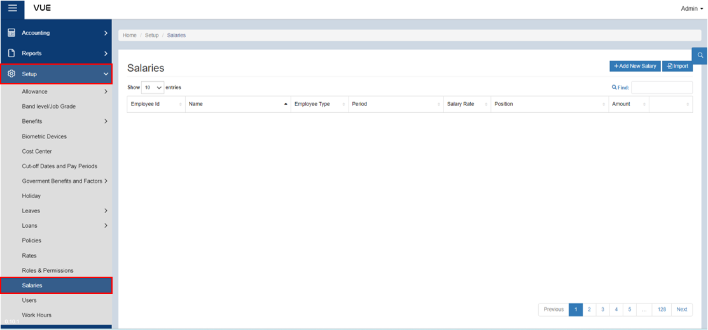

## Add Salary to an Employee

### Overview

This set of instructions guides you through the process of adding salary to an employee. The instructions also cover selecting the salary rate and period, setting the salary amount, and saving the changes. 

### Step 1: Preparing the Period Group and Period Date
Before adding a salary, make sure that the **Cut-off Dates and Pay Periods** is already set up. 

:::tip REMEMBER

If not, follow the instructions in the link below to create one.

:::

&nbsp;&nbsp;&nbsp;&nbsp;&nbsp;&nbsp;&nbsp;&nbsp;&nbsp;&nbsp;&nbsp;**➤** [Cut-off Dates and Pay Periods](./Setup/Cut-Off-Dates-Pay-Period.md)

#### Step 1: Go to the Salaries Page
To navigate to the Salaries Page, follow these steps:

&nbsp;&nbsp;&nbsp;&nbsp;&nbsp;&nbsp;&nbsp;&nbsp;&nbsp;&nbsp;&nbsp;**➥** Click on the **`Setup`** dropdown button.

&nbsp;&nbsp;&nbsp;&nbsp;&nbsp;&nbsp;&nbsp;&nbsp;&nbsp;&nbsp;&nbsp;**➥** Select **`Salaries`**.

You will be directed to the **Salaries Page**. 

### Step 2: Search by Filter
To filter the list:

&nbsp;&nbsp;&nbsp;&nbsp;&nbsp;&nbsp;&nbsp;&nbsp;&nbsp;&nbsp;&nbsp;**➥** Click on the **`🔍`** (filter) button.

&nbsp;&nbsp;&nbsp;&nbsp;&nbsp;&nbsp;&nbsp;&nbsp;&nbsp;&nbsp;&nbsp;**➥** Select the **Company, Location, Department, Division, Position, and Group** affiliation for the employee whose salary you want to add.

&nbsp;&nbsp;&nbsp;&nbsp;&nbsp;&nbsp;&nbsp;&nbsp;&nbsp;&nbsp;&nbsp;**➥** Click on the **`Search`** button to display all employees that match the selected filter criteria.

### Step 3: Adding a Salary
To add a salary for an employee, follow these steps:

&nbsp;&nbsp;&nbsp;&nbsp;&nbsp;&nbsp;&nbsp;&nbsp;&nbsp;&nbsp;&nbsp;**➥** Click on the **`Edit`** button.

You will be directed to another page where the Employee ID and Employee Name are displayed.

&nbsp;&nbsp;&nbsp;&nbsp;&nbsp;&nbsp;&nbsp;&nbsp;&nbsp;&nbsp;&nbsp;**➥** Select **`Employee Type`**

&nbsp;&nbsp;&nbsp;&nbsp;&nbsp;&nbsp;&nbsp;&nbsp;&nbsp;&nbsp;&nbsp;**➥** Select the **`Salary Rate`**

&nbsp;&nbsp;&nbsp;&nbsp;&nbsp;&nbsp;&nbsp;&nbsp;&nbsp;&nbsp;&nbsp;**➥** Select the **`Period`**

&nbsp;&nbsp;&nbsp;&nbsp;&nbsp;&nbsp;&nbsp;&nbsp;&nbsp;&nbsp;&nbsp;**➥** Input the **`Amount`**

### Step 4: Saving

&nbsp;&nbsp;&nbsp;&nbsp;&nbsp;&nbsp;&nbsp;&nbsp;&nbsp;&nbsp;&nbsp;**➥** Click the **`Save`** button to complete the process.

<!-- :::tip SUCCESS

Congratulations! You have successfully added a Salary for an employee. 

#### NEXT STEP...

- You can now create a process under **Timekeeping.**
- Click the **`Next`** button for the next instruction.

::: -->

