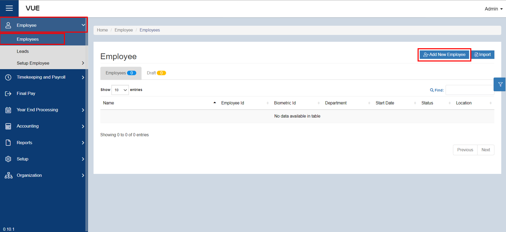
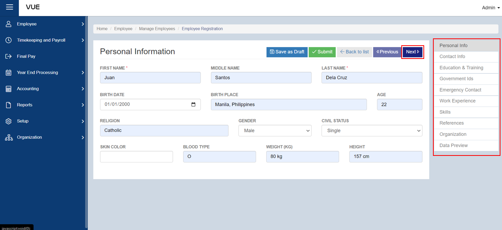
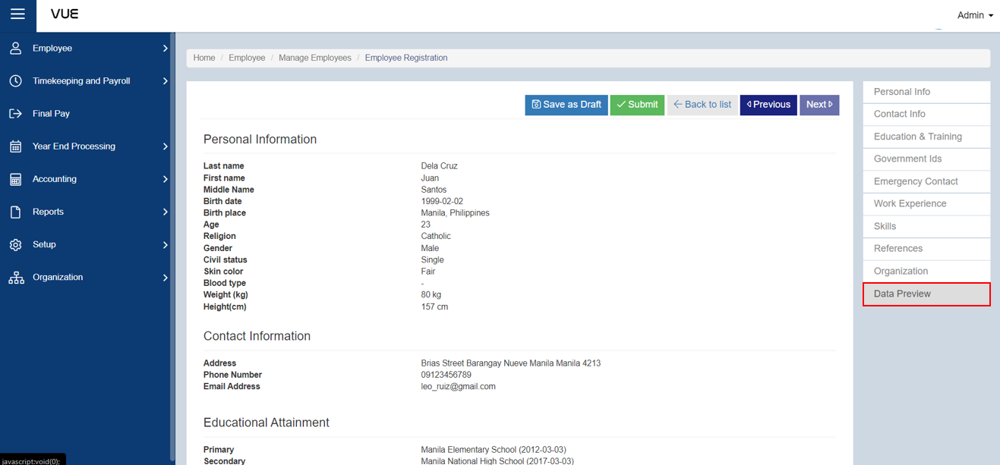
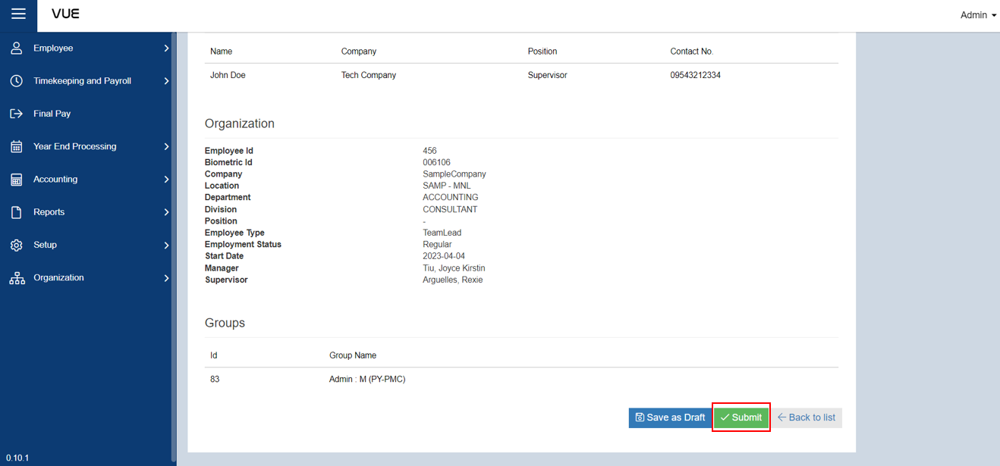

## Creating a New Employee Profile

### Overview

This section provides a step-by-step guide on how to set up a new profile for a new employee. The steps involved in creating a new employee profile are then outlined in detail, starting from gathering the necessary information about the employee, such as their name, email address, and job title. The page then guides the user through the process of entering the employee's information into the profile creation form. By following the steps outlined on the page, the user can easily create a new employee profile.

### Step 1: Preparing for Profile Creation
For each profile that will be created for an employee, it requires information such as the **Company, Location, Department, Position, and Group.**

:::tip REMEMBER

Make sure that these informations are already available, but if not, click on the links below for instructions on how to create them.

&nbsp;&nbsp;&nbsp;&nbsp;&nbsp;&nbsp;&nbsp;&nbsp;&nbsp;&nbsp;&nbsp;**➤** [Set up Company](./Setup/Company.md)

&nbsp;&nbsp;&nbsp;&nbsp;&nbsp;&nbsp;&nbsp;&nbsp;&nbsp;&nbsp;&nbsp;**➤** [Set up Department](./Setup/Department.md)

&nbsp;&nbsp;&nbsp;&nbsp;&nbsp;&nbsp;&nbsp;&nbsp;&nbsp;&nbsp;&nbsp;**➤** [Set up Group](./Setup/Group-Name.md)

&nbsp;&nbsp;&nbsp;&nbsp;&nbsp;&nbsp;&nbsp;&nbsp;&nbsp;&nbsp;&nbsp;**➤** [Set up Location](./Setup/Location.md)

&nbsp;&nbsp;&nbsp;&nbsp;&nbsp;&nbsp;&nbsp;&nbsp;&nbsp;&nbsp;&nbsp;**➤** [Set up Position](./Setup/Position.md)

:::

### Step 2: Creating the Employee Profile

To begin creating a new employee profile:

&nbsp;&nbsp;&nbsp;&nbsp;&nbsp;&nbsp;&nbsp;&nbsp;&nbsp;&nbsp;&nbsp;**➥** Click on the **`Employee`** dropdown button.

&nbsp;&nbsp;&nbsp;&nbsp;&nbsp;&nbsp;&nbsp;&nbsp;&nbsp;&nbsp;&nbsp;**➥** From the dropdown menu, select **`Employees`**. You will be directed to the **Employee List Page**.

&nbsp;&nbsp;&nbsp;&nbsp;&nbsp;&nbsp;&nbsp;&nbsp;&nbsp;&nbsp;&nbsp;**➥** Click on the **`Add New Employee`** button to create a new employee profile.

### Step 3: Enter Employee Information
&nbsp;&nbsp;&nbsp;&nbsp;&nbsp;&nbsp;&nbsp;&nbsp;&nbsp;&nbsp;&nbsp;**➥** All employees who will create a profile need to provide information for the following sections:

&nbsp;&nbsp;&nbsp;&nbsp;&nbsp;&nbsp;&nbsp;&nbsp;&nbsp;&nbsp;&nbsp;&nbsp;&nbsp;&nbsp;&nbsp;&nbsp;**➤** Personal Information

&nbsp;&nbsp;&nbsp;&nbsp;&nbsp;&nbsp;&nbsp;&nbsp;&nbsp;&nbsp;&nbsp;&nbsp;&nbsp;&nbsp;&nbsp;&nbsp;**➤** Contact Information

&nbsp;&nbsp;&nbsp;&nbsp;&nbsp;&nbsp;&nbsp;&nbsp;&nbsp;&nbsp;&nbsp;&nbsp;&nbsp;&nbsp;&nbsp;&nbsp;**➤** Education and Training

&nbsp;&nbsp;&nbsp;&nbsp;&nbsp;&nbsp;&nbsp;&nbsp;&nbsp;&nbsp;&nbsp;&nbsp;&nbsp;&nbsp;&nbsp;&nbsp;**➤** Government Ids

&nbsp;&nbsp;&nbsp;&nbsp;&nbsp;&nbsp;&nbsp;&nbsp;&nbsp;&nbsp;&nbsp;&nbsp;&nbsp;&nbsp;&nbsp;&nbsp;**➤** Emergency Contact

&nbsp;&nbsp;&nbsp;&nbsp;&nbsp;&nbsp;&nbsp;&nbsp;&nbsp;&nbsp;&nbsp;&nbsp;&nbsp;&nbsp;&nbsp;&nbsp;**➤** Work Experience

&nbsp;&nbsp;&nbsp;&nbsp;&nbsp;&nbsp;&nbsp;&nbsp;&nbsp;&nbsp;&nbsp;&nbsp;&nbsp;&nbsp;&nbsp;&nbsp;**➤** Skills

&nbsp;&nbsp;&nbsp;&nbsp;&nbsp;&nbsp;&nbsp;&nbsp;&nbsp;&nbsp;&nbsp;&nbsp;&nbsp;&nbsp;&nbsp;&nbsp;**➤** Reference

&nbsp;&nbsp;&nbsp;&nbsp;&nbsp;&nbsp;&nbsp;&nbsp;&nbsp;&nbsp;&nbsp;&nbsp;&nbsp;&nbsp;&nbsp;&nbsp;**➤** Organization

:::info

**➥** Click **`Next`** button to proceed to the next form to fill. 

:::

:::info INFORMATION

To enter the required information for **Emergency Contact**, **Work Experience**, **Skills**, and **Reference**: 

**➥** Click the **`Add`** button to enter the information.

**➥** You can undo/delete by clicking the **`Delete`** button.

:::

### Step 4: Preview the Information
After entering the employee information as shown above, preview it to ensure that all information is correct.

&nbsp;&nbsp;&nbsp;&nbsp;&nbsp;&nbsp;&nbsp;&nbsp;&nbsp;&nbsp;&nbsp;**➥** Click on the **`Preview`** button to preview all the informations.

### Step 5: Save the Employee Profile

Once you have reviewed and confirmed that all the required information has been entered, you can now save it.

&nbsp;&nbsp;&nbsp;&nbsp;&nbsp;&nbsp;&nbsp;&nbsp;&nbsp;&nbsp;&nbsp;**➥** Click on the **`Submit`** button to complete the process.

:::info INFORMATION

**➥** If you have not yet completed filling out the information, you can save your progress by clicking on the **`Save as Draft`** button.

**➥** To go back to the Employee List, simply click on the **`Back to List`** button.

**➥** To view your saved drafts, click on the **`Draft`** tab located in the Employee List.

:::

:::tip SUCCESS

Congratulations! You have successfully created an **Employee Profile.**

#### NEXT STEP...

- You can now enroll an Employee to a **Benefit, Allowance, and Leave.** 
- Click the **`Next`** button for the next instruction.

:::
