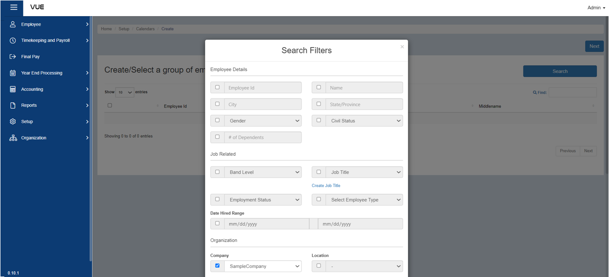

## Create Work Schedule for an Employee

### Overview

This page provides a clear and easy-to-follow guide on how to create work schedules, presented in a step-by-step format. You can use it as a reference to make the process more efficient and organized.

### Step 1: Prepare for Work Schedule Creation

Before creating a work schedule for an employee, make sure you have their **working hours** information ready. 

:::tip REMEMBER

If you don't have it, follow the instructions in the link below to create one.

:::

&nbsp;&nbsp;&nbsp;&nbsp;&nbsp;&nbsp;&nbsp;&nbsp;&nbsp;&nbsp;&nbsp;**➤** [Set up Working Hours](./Setup/Working-Hours.md)

### Step 2: Go to the Work Schedule Page

To navigate to the Work Schedule Page, follow these steps:

&nbsp;&nbsp;&nbsp;&nbsp;&nbsp;&nbsp;&nbsp;&nbsp;&nbsp;&nbsp;&nbsp;**➥** Click on the **`Setup`** dropdown button.

&nbsp;&nbsp;&nbsp;&nbsp;&nbsp;&nbsp;&nbsp;&nbsp;&nbsp;&nbsp;&nbsp;**➥** Select **`Work Schedules`**.

You will be directed to the **Work Schedules Page**. 

### Step 3: Search by Filter
To search for an employee:

&nbsp;&nbsp;&nbsp;&nbsp;&nbsp;&nbsp;&nbsp;&nbsp;&nbsp;&nbsp;&nbsp;**➥** Click on the **`Add New Calendar`** button.

You will be prompted with a search filter. In this, you can search an employee using their credentials such as Company Name, Group, etc.

&nbsp;&nbsp;&nbsp;&nbsp;&nbsp;&nbsp;&nbsp;&nbsp;&nbsp;&nbsp;&nbsp;**➥** For example, put a check on the **Company Name** and select a **Company**.

&nbsp;&nbsp;&nbsp;&nbsp;&nbsp;&nbsp;&nbsp;&nbsp;&nbsp;&nbsp;&nbsp;**➥** Click on the **`Search`** button.

&nbsp;&nbsp;&nbsp;&nbsp;&nbsp;&nbsp;&nbsp;&nbsp;&nbsp;&nbsp;&nbsp;**➥** Select the **Employee** and click **`Next`**.

You will be directed to the **Create Work Schedule** Page

### Step 4: Create a Work Schedule for an Employee
To create work schedule for an employee, follow these steps:

&nbsp;&nbsp;&nbsp;&nbsp;&nbsp;&nbsp;&nbsp;&nbsp;&nbsp;&nbsp;&nbsp;**➥** Click on the **`Create a Repeating Working Schedule`** button.

&nbsp;&nbsp;&nbsp;&nbsp;&nbsp;&nbsp;&nbsp;&nbsp;&nbsp;&nbsp;&nbsp;**➥** Select the schedule for the **working days** and input the **minutes of breaks**.

&nbsp;&nbsp;&nbsp;&nbsp;&nbsp;&nbsp;&nbsp;&nbsp;&nbsp;&nbsp;&nbsp;**➥** Click **`Apply`** button.

 

:::info INFORMATION

Scroll down to see a list of available hours as your guide.

:::

&nbsp;&nbsp;&nbsp;&nbsp;&nbsp;&nbsp;&nbsp;&nbsp;&nbsp;&nbsp;&nbsp;**➥** Click **`Next`** button

### Step 5: Adding a Title and Submit

&nbsp;&nbsp;&nbsp;&nbsp;&nbsp;&nbsp;&nbsp;&nbsp;&nbsp;&nbsp;&nbsp;**➥** Input **title** for the work schedules.

&nbsp;&nbsp;&nbsp;&nbsp;&nbsp;&nbsp;&nbsp;&nbsp;&nbsp;&nbsp;&nbsp;**➥** Click **`Submit`** button.

:::tip SUCCESS

Congratulations! You have successfully created a **Work Schedule** for an employee.

#### NEXT STEP...

- You can now create **Policies** for an Employee. 
- Click the **`Next`** button for the next instruction.

:::