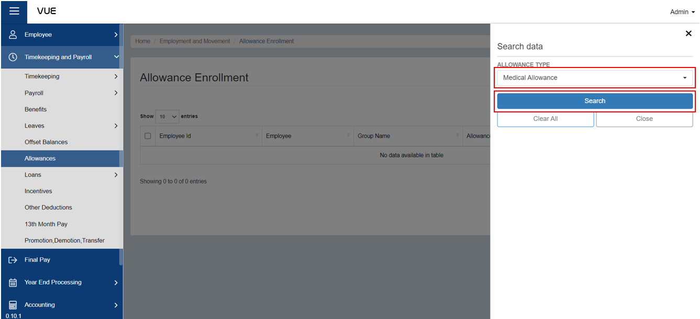

## Enroll to an Allowance

### Overview

This section provides a clear and straightforward guide on how to enroll allowances to employees, presented in a step-by-step format. This can be used as a reference to make the process more efficient and organized.

### Step 1: Preparing for Allowance Enrollment
In order to enroll an employee's leave, it is necessary to have a corresponding leave type that suits their requirements. It is also important to set the entitlement to distinguish what type of leave they are eligible for. If there is currently no leave type or entitlement available, you can follow the link below for a step-by-step guide on how to create one.

&nbsp;&nbsp;&nbsp;&nbsp;&nbsp;&nbsp;&nbsp;&nbsp;&nbsp;&nbsp;&nbsp;**➤** [Creating an allowance type](./Setup/Allowance-Type.md)

&nbsp;&nbsp;&nbsp;&nbsp;&nbsp;&nbsp;&nbsp;&nbsp;&nbsp;&nbsp;&nbsp;**➤** [Setting up Allowance Entitlement](./Setup/Allowance-Entitlement.md)

### Step 2: Go to the Allowance Enrollment Page
To go to the Allowance Enrollment Page:

&nbsp;&nbsp;&nbsp;&nbsp;&nbsp;&nbsp;&nbsp;&nbsp;&nbsp;&nbsp;&nbsp;**➥** Click on the **`Timekeeping and Payroll`** dropdown button.

&nbsp;&nbsp;&nbsp;&nbsp;&nbsp;&nbsp;&nbsp;&nbsp;&nbsp;&nbsp;&nbsp;**➥** Click on **`Allowances`**.

You will be directed to the **Allowance Enrollment Page**. 

### Step 3: Search by Filter
To filter the list:

&nbsp;&nbsp;&nbsp;&nbsp;&nbsp;&nbsp;&nbsp;&nbsp;&nbsp;&nbsp;&nbsp;**➥** Click on the **`🔍`** (filter) button.

&nbsp;&nbsp;&nbsp;&nbsp;&nbsp;&nbsp;&nbsp;&nbsp;&nbsp;&nbsp;&nbsp;**➥** Choose the **desired allowance type.**

&nbsp;&nbsp;&nbsp;&nbsp;&nbsp;&nbsp;&nbsp;&nbsp;&nbsp;&nbsp;&nbsp;**➥** Click the **`Search`** button to view a list of employees who are either enrolled or not enrolled in the allowance type selected. 

### Step 4: Enrolling for an Allowance
To enroll an employee to an Allowance:

&nbsp;&nbsp;&nbsp;&nbsp;&nbsp;&nbsp;&nbsp;&nbsp;&nbsp;&nbsp;&nbsp;**➥** Make sure that an Employee is entitled to receive the type of allowance selected.

&nbsp;&nbsp;&nbsp;&nbsp;&nbsp;&nbsp;&nbsp;&nbsp;&nbsp;&nbsp;&nbsp;**➥** After filtering, you will presented list of employees. 

:::info INFORMATION

If there is a huge number of employees, you can simply **enter the employee's name in the search bar** after filtering.

:::

&nbsp;&nbsp;&nbsp;&nbsp;&nbsp;&nbsp;&nbsp;&nbsp;&nbsp;&nbsp;&nbsp;**➥** Check the **"Is Enrolled"** column to see if the employee is already enrolled.

&nbsp;&nbsp;&nbsp;&nbsp;&nbsp;&nbsp;&nbsp;&nbsp;&nbsp;&nbsp;&nbsp;**➥** If not, enroll the employee in the selected allowance type by clicking the **`Enroll`** button located in the rightmost column.

You will then be directed to the **Employee Allowance Enrollment Page**, which will display the employee's name and the allowance type they are enrolling in. 

&nbsp;&nbsp;&nbsp;&nbsp;&nbsp;&nbsp;&nbsp;&nbsp;&nbsp;&nbsp;&nbsp;**➥** Choose **when the allowance will apply to their payroll** (either the first pay of the month, last pay of the month, or every pay) 

&nbsp;&nbsp;&nbsp;&nbsp;&nbsp;&nbsp;&nbsp;&nbsp;&nbsp;&nbsp;&nbsp;**➥** Enter the **amount**.

&nbsp;&nbsp;&nbsp;&nbsp;&nbsp;&nbsp;&nbsp;&nbsp;&nbsp;&nbsp;&nbsp;**➥** Indicate whether the amount is **fixed or not** by checking the box.

### Step 5: Saving
&nbsp;&nbsp;&nbsp;&nbsp;&nbsp;&nbsp;&nbsp;&nbsp;&nbsp;&nbsp;&nbsp;**➥** Click the **`Save`** button to complete the enrollment process.

:::info INFORMATION

If you want to view the details of the enrollment, you can click on the **`Details`** button.

::: 

:::tip SUCCESS

Congratulations! You have successfully enrolled the Employee to an **Allowance**

#### NEXT STEP...

- You can now create a **Work Schedule** for an Employee. 
- Click the **`Next`** button for the next instruction.

:::

