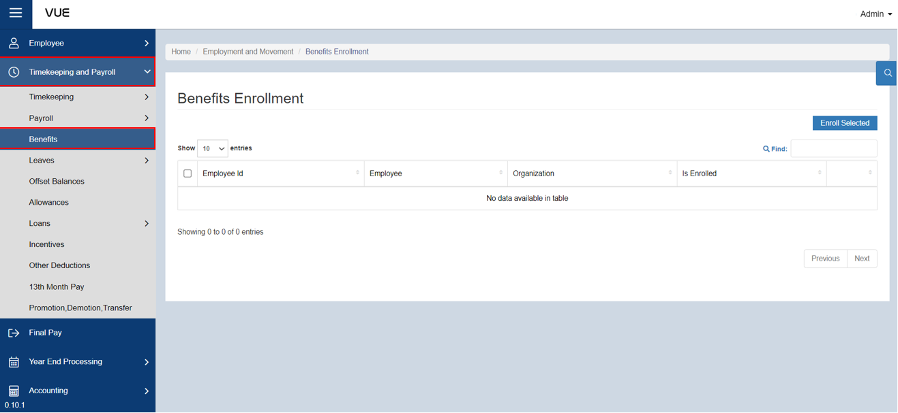
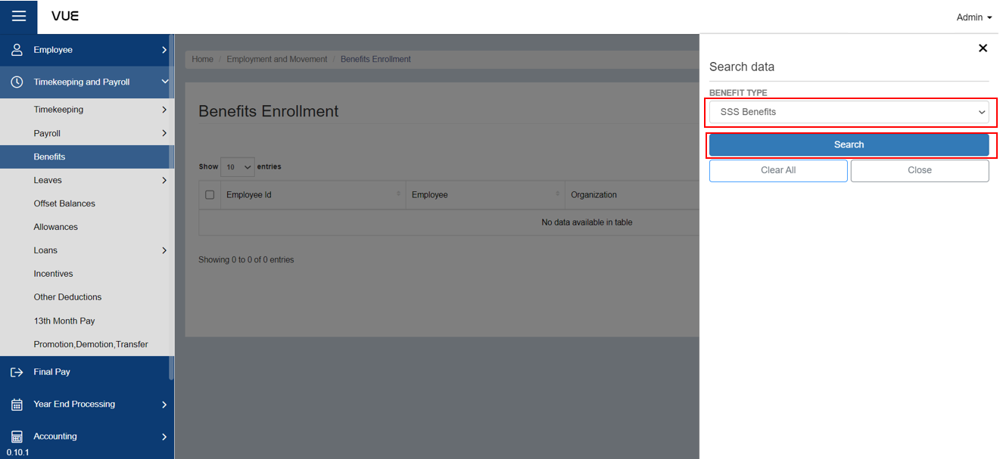
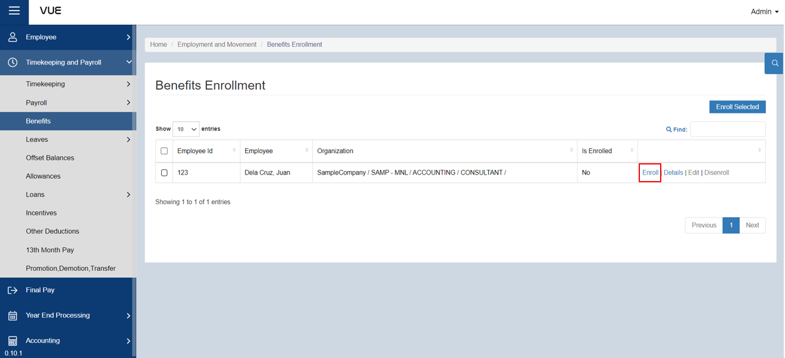
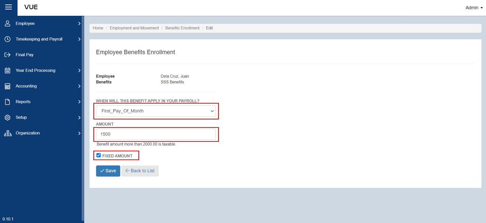
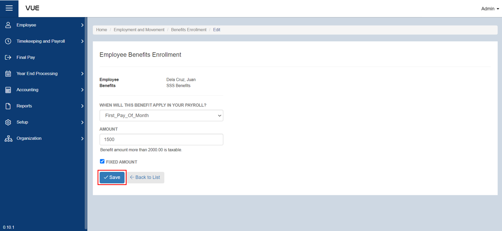

## Enroll to a Benefit

### Overview

This setion provides step-by-step instructions for enrolling an employee in a company benefit. Follow these clear and concise instructions to ensure that the enrollment process is quick and easy. You'll learn how to navigate the enrollment page, search for employees, and enroll them in their desired benefits.

### Step 1: Preparing for Benefit Enrollment
To enroll an employee for a company benefit, you need to have a **benefit type** and **entitlement** in place to determine their eligibility. If you haven't created a benefit type and entitlement yet, you can follow the links below for a clear guide on how to set them up step-by-step.

&nbsp;&nbsp;&nbsp;&nbsp;&nbsp;&nbsp;&nbsp;&nbsp;&nbsp;&nbsp;&nbsp;**➤** [Creating a Benefit Type](./Setup/Benefit-Type.md)

&nbsp;&nbsp;&nbsp;&nbsp;&nbsp;&nbsp;&nbsp;&nbsp;&nbsp;&nbsp;&nbsp;**➤** [Setting up Benefit Entitlement](./Setup/Benefit-Entitlement.md)

### Step 2: Go to the Benefit Enrollment Page
To go to the Benefits Enrollment Page:

&nbsp;&nbsp;&nbsp;&nbsp;&nbsp;&nbsp;&nbsp;&nbsp;&nbsp;&nbsp;&nbsp;**➥** Click on the **`Timekeping and Payroll`** dropdown button.

&nbsp;&nbsp;&nbsp;&nbsp;&nbsp;&nbsp;&nbsp;&nbsp;&nbsp;&nbsp;&nbsp;**➥** Select **`Benefits`**.

You will be directed to the **Benefits Enrollment Page**. 

### Step 3: Search by Filter
To filter the list:

&nbsp;&nbsp;&nbsp;&nbsp;&nbsp;&nbsp;&nbsp;&nbsp;&nbsp;&nbsp;&nbsp;**➥** Click on the **`🔍`** (filter) button.

&nbsp;&nbsp;&nbsp;&nbsp;&nbsp;&nbsp;&nbsp;&nbsp;&nbsp;&nbsp;&nbsp;**➥** Choose the desired **benefit type.**

&nbsp;&nbsp;&nbsp;&nbsp;&nbsp;&nbsp;&nbsp;&nbsp;&nbsp;&nbsp;&nbsp;**➥** Click the **`Search`** button to view a list of employees who are either enrolled or not enrolled in the benefit type selected. 

### Step 4: Enrolling for a Benefit
To enroll an employee to a benefit:

&nbsp;&nbsp;&nbsp;&nbsp;&nbsp;&nbsp;&nbsp;&nbsp;&nbsp;&nbsp;&nbsp;**➥** Make sure that an Employee is **entitled to receive the type of benefit selected**.

&nbsp;&nbsp;&nbsp;&nbsp;&nbsp;&nbsp;&nbsp;&nbsp;&nbsp;&nbsp;&nbsp;**➥** After filtering, you will presented list of employees. 

:::info INFORMATION

If there is a huge number of employees, you can simply **enter the employee's name in the search bar** after filtering.

:::

&nbsp;&nbsp;&nbsp;&nbsp;&nbsp;&nbsp;&nbsp;&nbsp;&nbsp;&nbsp;&nbsp;**➥** Check the **"Is Enrolled"** column to see if the employee is already enrolled.

&nbsp;&nbsp;&nbsp;&nbsp;&nbsp;&nbsp;&nbsp;&nbsp;&nbsp;&nbsp;&nbsp;**➥** If not, enroll the employee by clicking the **`Enroll`** button located in the rightmost column.

You will then be directed to the **Employee Benefits Enrollment Page**, which will display the employee's name and the benefit type they are enrolling in.

&nbsp;&nbsp;&nbsp;&nbsp;&nbsp;&nbsp;&nbsp;&nbsp;&nbsp;&nbsp;&nbsp;**➥** Choose **when the benefit will apply to their payroll** (either the first pay of the month, last pay of the month, or every pay)

&nbsp;&nbsp;&nbsp;&nbsp;&nbsp;&nbsp;&nbsp;&nbsp;&nbsp;&nbsp;&nbsp;**➥** Enter the **amount**

&nbsp;&nbsp;&nbsp;&nbsp;&nbsp;&nbsp;&nbsp;&nbsp;&nbsp;&nbsp;&nbsp;**➥** Indicate whether the amount is **fixed or not** by checking the box.

:::caution REMEMBER

Benefit amount more than 2000.00 is taxable.

:::

### Step 5: Saving
&nbsp;&nbsp;&nbsp;&nbsp;&nbsp;&nbsp;&nbsp;&nbsp;&nbsp;&nbsp;&nbsp;**➥** Click the **`Save`** button to complete the enrollment process.

:::tip SUCCESS

Congratulations! You have successfully enrolled the Employee to a **Benefit**

#### NEXT STEP...

- Enroll for a **Leave**.
- Click the **`Next`** button for the next instruction.

:::

