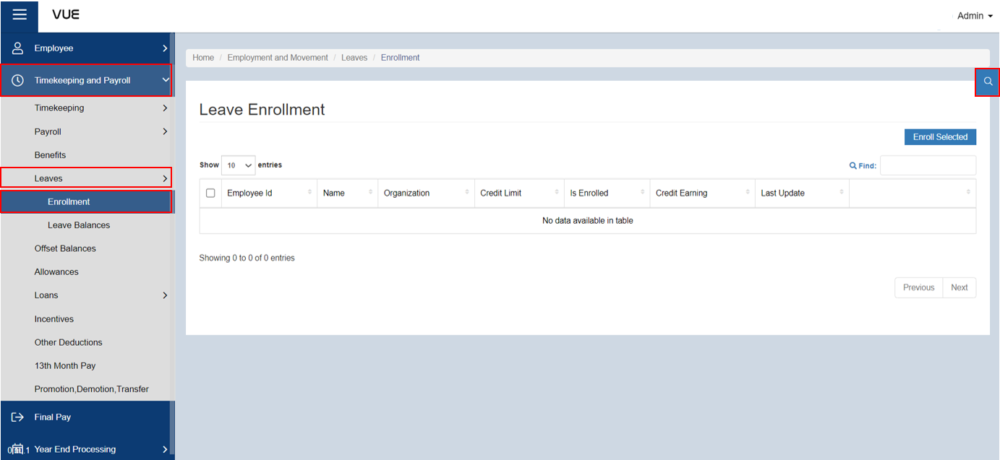
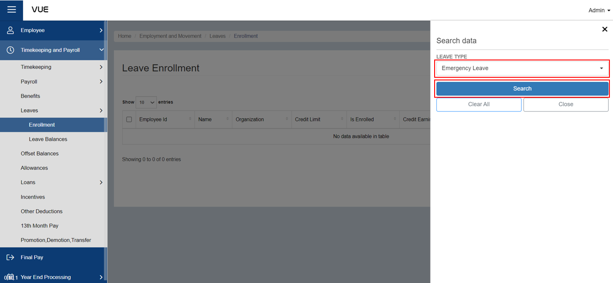
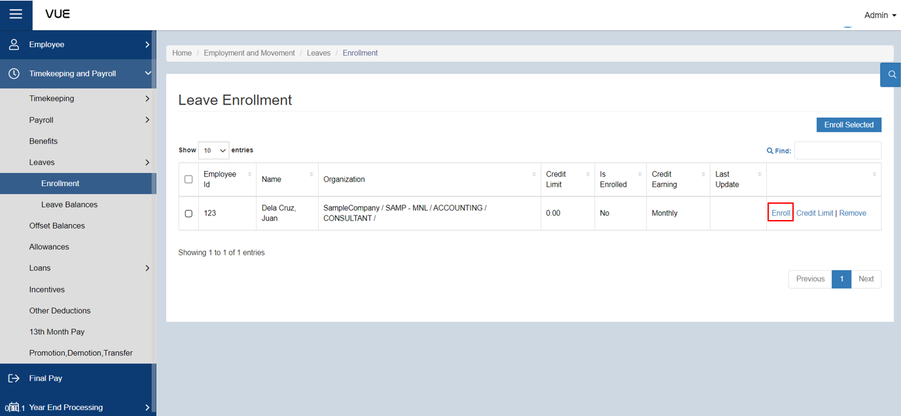
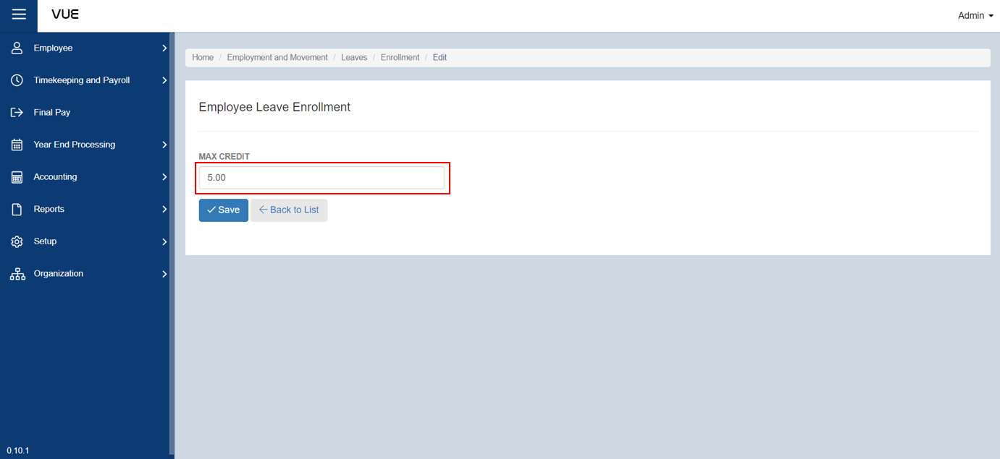
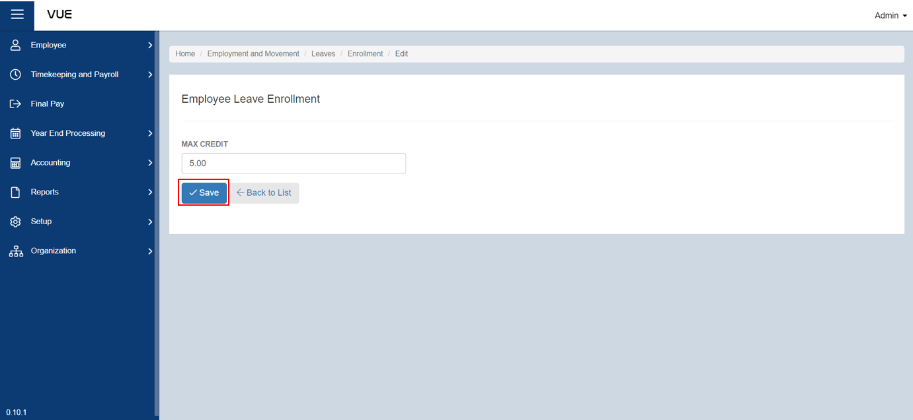

## Enroll to a Leave

### Overview

This section provides step-by-step instructions on how to enroll an employee in a specific type of leave. The instructions guide the user through the process of navigating to the "Leaves" section, selecting the desired leave type, and enrolling the employee. The section also includes details on how to set the maximum credit for the chosen employee.

### Step 1: Preparing for Leave Enrollment
To enroll an employee's leave, you must first ensure that there is a corresponding leave type that suits their needs. In addition, it is necessary to set the entitlement to distinguish the type of leave they are entitled to. If there are no available leave types and entitlements yet, you can follow the step-by-step guide by clicking on the link below to create one.

&nbsp;&nbsp;&nbsp;&nbsp;&nbsp;&nbsp;&nbsp;&nbsp;&nbsp;&nbsp;&nbsp;**➤** [Creating a Leave Type](./Setup/Leave-Type.md)

&nbsp;&nbsp;&nbsp;&nbsp;&nbsp;&nbsp;&nbsp;&nbsp;&nbsp;&nbsp;&nbsp;**➤** [Setting up Leave Configuration](./Setup/Leave-Configuration.md)

&nbsp;&nbsp;&nbsp;&nbsp;&nbsp;&nbsp;&nbsp;&nbsp;&nbsp;&nbsp;&nbsp;**➤** [Setting up Leave Entitlement](./Setup/Leave-Entitlement.md)

### Step 2: Go to the Leaves Enrollment Page
To go to the Leaves Enrollment Page:

&nbsp;&nbsp;&nbsp;&nbsp;&nbsp;&nbsp;&nbsp;&nbsp;&nbsp;&nbsp;&nbsp;**➥** Click on the **`Timekeeping and Payroll`** dropdown button.

&nbsp;&nbsp;&nbsp;&nbsp;&nbsp;&nbsp;&nbsp;&nbsp;&nbsp;&nbsp;&nbsp;**➥** Click on **`Leaves`**.

&nbsp;&nbsp;&nbsp;&nbsp;&nbsp;&nbsp;&nbsp;&nbsp;&nbsp;&nbsp;&nbsp;**➥** Select **`Enrollment`**.

You will be directed to the **Leaves Enrollment Page**. 

### Step 3: Search by Filter
To filter the list:

&nbsp;&nbsp;&nbsp;&nbsp;&nbsp;&nbsp;&nbsp;&nbsp;&nbsp;&nbsp;&nbsp;**➥** Click on the **`🔍`** (filter) button.

&nbsp;&nbsp;&nbsp;&nbsp;&nbsp;&nbsp;&nbsp;&nbsp;&nbsp;&nbsp;&nbsp;**➥** Choose the **desired leave type.**

&nbsp;&nbsp;&nbsp;&nbsp;&nbsp;&nbsp;&nbsp;&nbsp;&nbsp;&nbsp;&nbsp;**➥** Click the **`Search`** button to view a list of employees who are either enrolled or not enrolled in the leave type selected. 

### Step 4: Enrolling for a Leave
To enroll an employee to a leave:

&nbsp;&nbsp;&nbsp;&nbsp;&nbsp;&nbsp;&nbsp;&nbsp;&nbsp;&nbsp;&nbsp;**➥** Make sure that an Employee is entitled to receive the type of allowance selected.

&nbsp;&nbsp;&nbsp;&nbsp;&nbsp;&nbsp;&nbsp;&nbsp;&nbsp;&nbsp;&nbsp;**➥** After filtering, you will presented list of employees. 

:::info INFORMATION

If there is a huge number of employees, you can simply **enter the employee's name in the search bar** after filtering.

:::

&nbsp;&nbsp;&nbsp;&nbsp;&nbsp;&nbsp;&nbsp;&nbsp;&nbsp;&nbsp;&nbsp;**➥** Check the **"Is Enrolled"** column to see if the employee is already enrolled.

&nbsp;&nbsp;&nbsp;&nbsp;&nbsp;&nbsp;&nbsp;&nbsp;&nbsp;&nbsp;&nbsp;**➥** If not, enroll the employee in the selected leave type by clicking the **`Enroll`** button located in the rightmost column.

You will be directed to the leave enrollment page where you can set the maximum credit for the chosen employee.

### Step 5: Saving
&nbsp;&nbsp;&nbsp;&nbsp;&nbsp;&nbsp;&nbsp;&nbsp;&nbsp;&nbsp;&nbsp;**➥** Once you have set the maximum credit, click the **`Save`** button to complete the enrollment process.

:::info INFORMATION

If you want to view the details of the enrollment, you can click on the **`Credit limit`** option.

:::

:::tip SUCCESS

Congratulations! You have successfully enrolled the Employee to a **Leave**

#### NEXT STEP...

- Enroll for an **Allowance**.
- Click the **`Next`** button for the next instruction.

:::