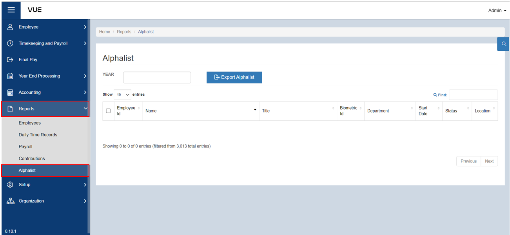
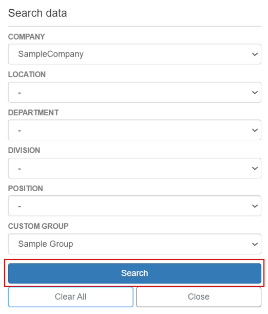
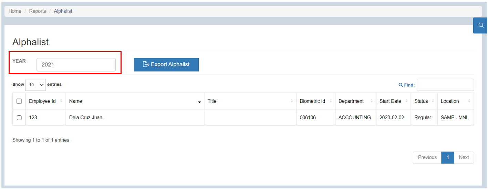
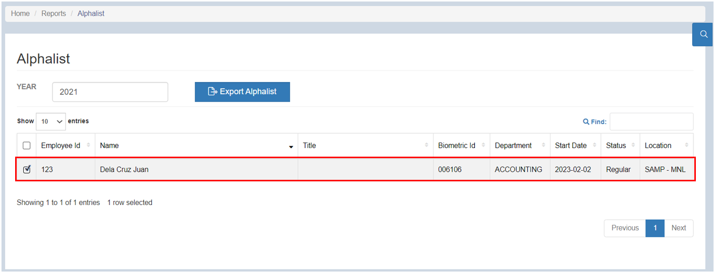
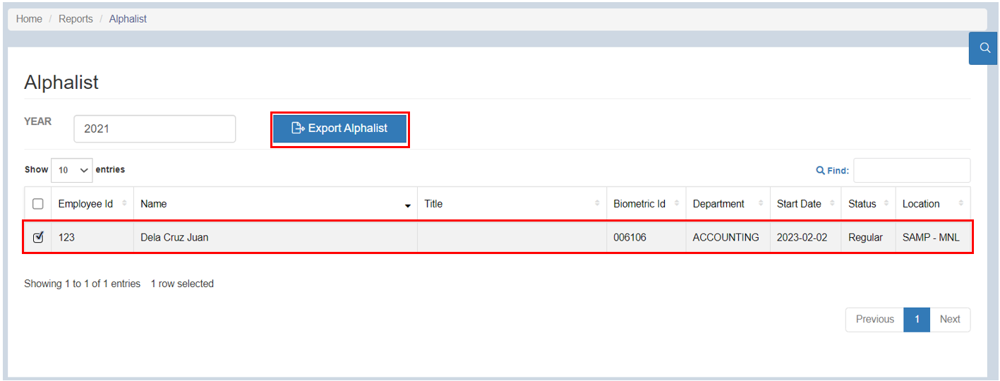

## Export Alphalist

### Overview

This page provides a detailed guide on how to export Alphalist reports. By following these step-by-step instructions, users will be able to navigate the reporting functionality, select the desired report parameters, and generate comprehensive reports containing employee information for tax compliance purposes. 

### Step 1: Navigate to the Page
To navigate to the page:

&nbsp;&nbsp;&nbsp;&nbsp;&nbsp;&nbsp;&nbsp;&nbsp;&nbsp;&nbsp;&nbsp;**➥** Click on the **`Reports`** dropdown button.

&nbsp;&nbsp;&nbsp;&nbsp;&nbsp;&nbsp;&nbsp;&nbsp;&nbsp;&nbsp;&nbsp;**➥** Select **`Alphalist`**.

### Step 2: Search by Filter
To filter the list:

&nbsp;&nbsp;&nbsp;&nbsp;&nbsp;&nbsp;&nbsp;&nbsp;&nbsp;&nbsp;&nbsp;**➥** Click on the **`🔍`** (filter) button.

&nbsp;&nbsp;&nbsp;&nbsp;&nbsp;&nbsp;&nbsp;&nbsp;&nbsp;&nbsp;&nbsp;**➥** Select the **Company name** and select the **group name** where the employee belongs.

&nbsp;&nbsp;&nbsp;&nbsp;&nbsp;&nbsp;&nbsp;&nbsp;&nbsp;&nbsp;&nbsp;**➥** Click the **`Search`** button to view the list.

:::info INFORMATION

If there is a huge number of employees, you can simply **enter the employee's name in the search bar** after filtering.

:::

### Step 3: Exporting Alphalist Report

To Alphalist Report:

&nbsp;&nbsp;&nbsp;&nbsp;&nbsp;&nbsp;&nbsp;&nbsp;&nbsp;&nbsp;&nbsp;**➥** Input the year.

&nbsp;&nbsp;&nbsp;&nbsp;&nbsp;&nbsp;&nbsp;&nbsp;&nbsp;&nbsp;&nbsp;**➥** Select the employees for whom you want to export Alphalist report.

&nbsp;&nbsp;&nbsp;&nbsp;&nbsp;&nbsp;&nbsp;&nbsp;&nbsp;&nbsp;&nbsp;**➥** Click the **`Export Alphalist`** button to export the Alphalist report of an employee in an Excel file.

:::tip SUCCESS

Congratulations! You have successfully exported **Alphalist** Report

:::

