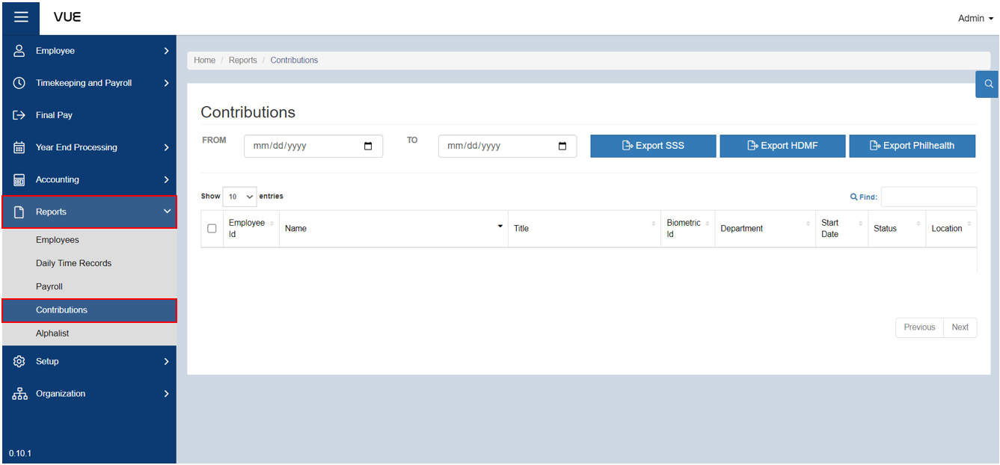
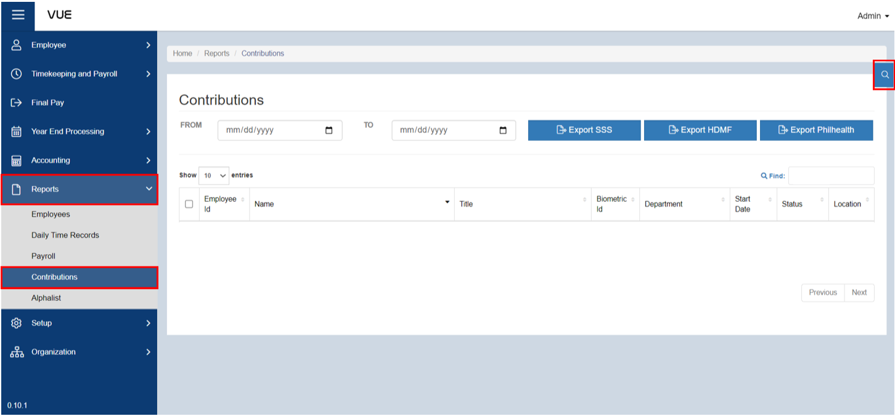
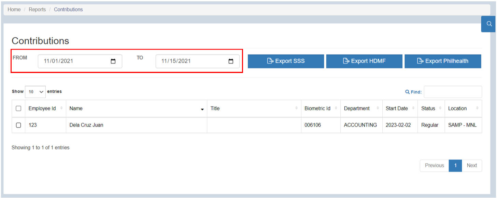
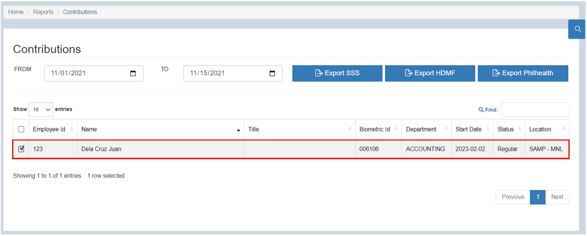
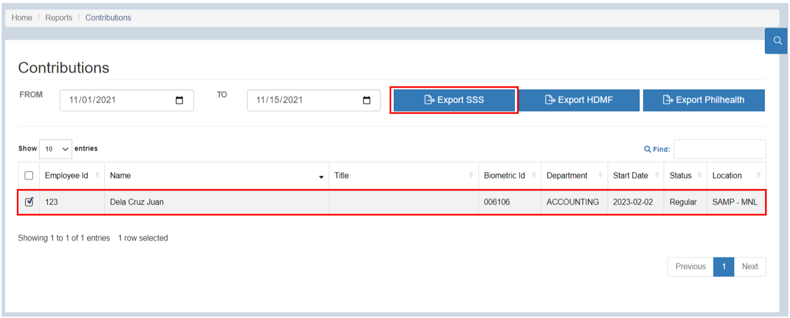
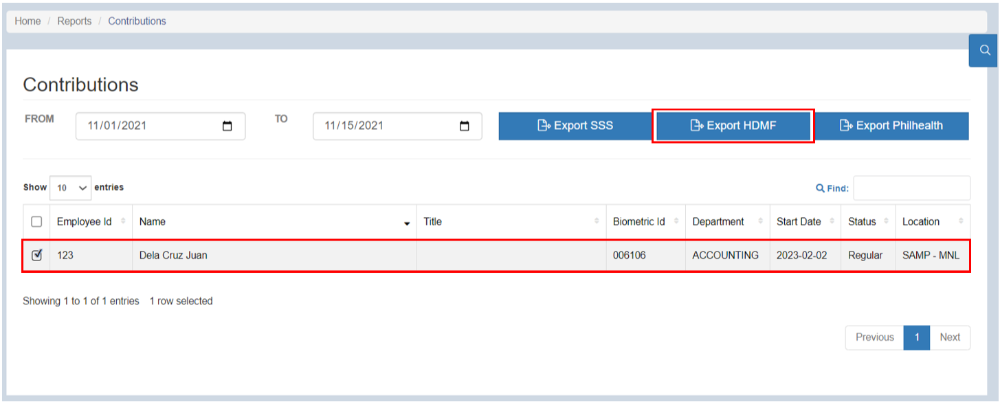
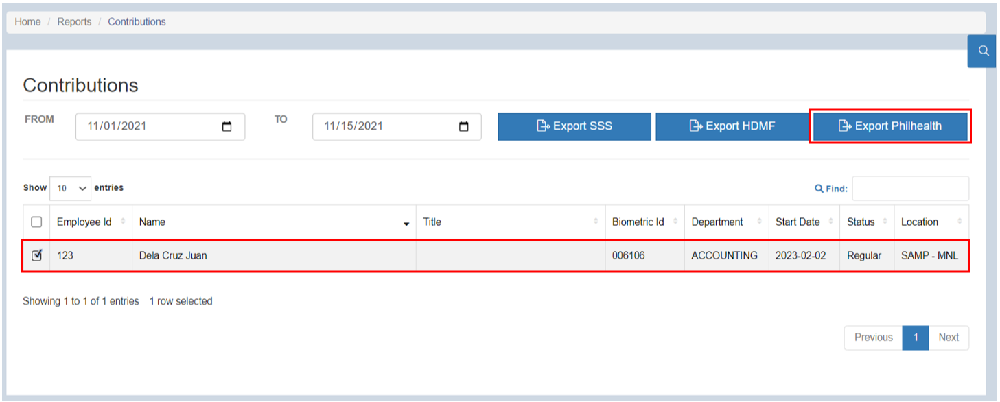

## Export Contribution Report

### Overview

This page provides a comprehensive guide on how to export Contribution for SSS (Social Security System), HDMF (Home Development Mutual Fund), and PhilHealth (Philippine Health Insurance Corporation) reports. By following these step-by-step instructions, users will be able to access the reporting functionality, select the desired report parameters, and generate comprehensive reports that capture employee contributions for these important government-mandated programs. 

### Step 1: Navigate to the Page
To navigate to the page:

&nbsp;&nbsp;&nbsp;&nbsp;&nbsp;&nbsp;&nbsp;&nbsp;&nbsp;&nbsp;&nbsp;**➥** Click on the **`Reports`** dropdown button.

&nbsp;&nbsp;&nbsp;&nbsp;&nbsp;&nbsp;&nbsp;&nbsp;&nbsp;&nbsp;&nbsp;**➥** Select **`Contributions`**.

### Step 2: Search by Filter
To filter the list:

&nbsp;&nbsp;&nbsp;&nbsp;&nbsp;&nbsp;&nbsp;&nbsp;&nbsp;&nbsp;&nbsp;**➥** Click on the **`🔍`** (filter) button.

&nbsp;&nbsp;&nbsp;&nbsp;&nbsp;&nbsp;&nbsp;&nbsp;&nbsp;&nbsp;&nbsp;**➥** Select the **Company name** and select the **group name** where the employee belongs.

&nbsp;&nbsp;&nbsp;&nbsp;&nbsp;&nbsp;&nbsp;&nbsp;&nbsp;&nbsp;&nbsp;**➥** Click the **`Search`** button to view the list.

:::info INFORMATION

If there is a huge number of employees, you can simply **enter the employee's name in the search bar** after filtering.

:::

### Step 3: Exporting SSS Contibution Report

To SSS Contribution Report:

&nbsp;&nbsp;&nbsp;&nbsp;&nbsp;&nbsp;&nbsp;&nbsp;&nbsp;&nbsp;&nbsp;**➥** Select the range of date.

&nbsp;&nbsp;&nbsp;&nbsp;&nbsp;&nbsp;&nbsp;&nbsp;&nbsp;&nbsp;&nbsp;**➥** Select the employees for whom you want to export SSS contribution report.

&nbsp;&nbsp;&nbsp;&nbsp;&nbsp;&nbsp;&nbsp;&nbsp;&nbsp;&nbsp;&nbsp;**➥** Click the **`Export SSS`** button to export the SSS contribution report of an employee in an Excel file.

### Step 4: Exporting HDMF Contribution Report

To export HDMF Contribution Report:

&nbsp;&nbsp;&nbsp;&nbsp;&nbsp;&nbsp;&nbsp;&nbsp;&nbsp;&nbsp;&nbsp;**➥** Select the range of date.

&nbsp;&nbsp;&nbsp;&nbsp;&nbsp;&nbsp;&nbsp;&nbsp;&nbsp;&nbsp;&nbsp;**➥** Select the employees for whom you want to export HDMF contribution report.

&nbsp;&nbsp;&nbsp;&nbsp;&nbsp;&nbsp;&nbsp;&nbsp;&nbsp;&nbsp;&nbsp;**➥** Click the **`Export HDMF`** button to export HDMF contribution report of an employee in an Excel file.

### Step 5: Exporting Phhilhealth Contribution Report

To export Philhealth Contribution Report:

&nbsp;&nbsp;&nbsp;&nbsp;&nbsp;&nbsp;&nbsp;&nbsp;&nbsp;&nbsp;&nbsp;**➥** Select the range of date.

&nbsp;&nbsp;&nbsp;&nbsp;&nbsp;&nbsp;&nbsp;&nbsp;&nbsp;&nbsp;&nbsp;**➥** Select the employees for whom you want to export HDMF contribution report.

&nbsp;&nbsp;&nbsp;&nbsp;&nbsp;&nbsp;&nbsp;&nbsp;&nbsp;&nbsp;&nbsp;**➥** Click the **`Export Philhealth`** button to export Philhealth contribution report of an employee in an Excel file.

:::tip SUCCESS

Congratulations! You have successfully exported **SSS, HDMF, and Philhealth Contribution** Report

:::

