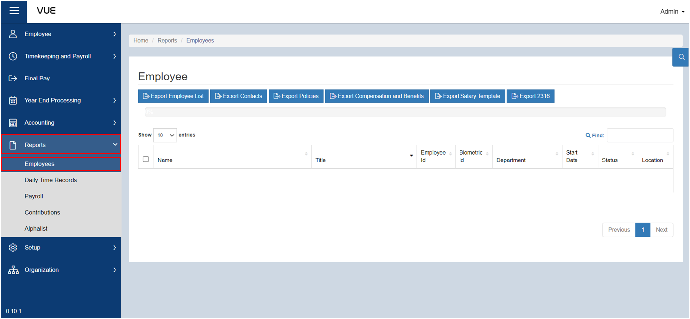
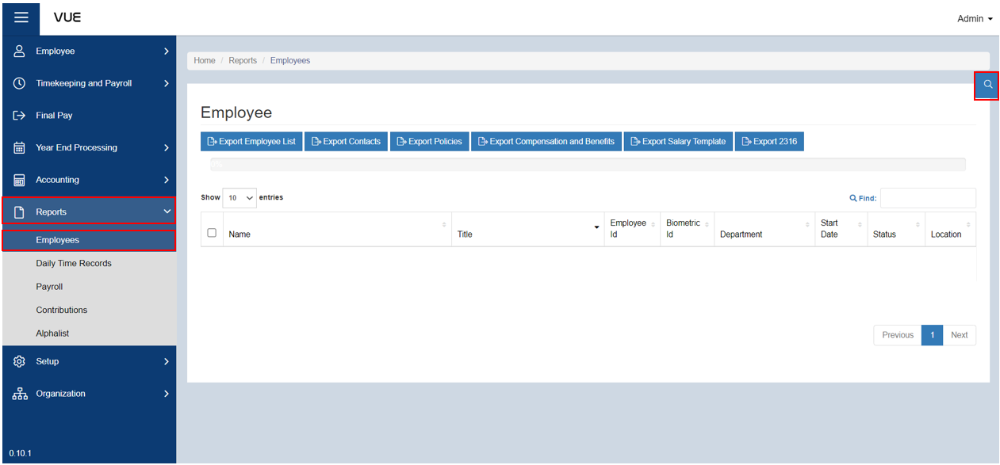
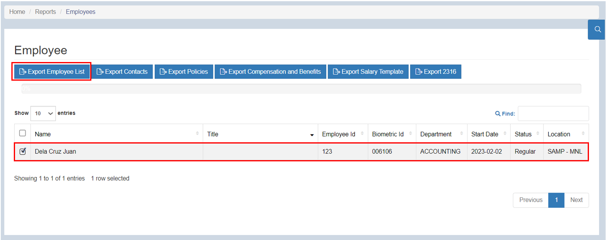
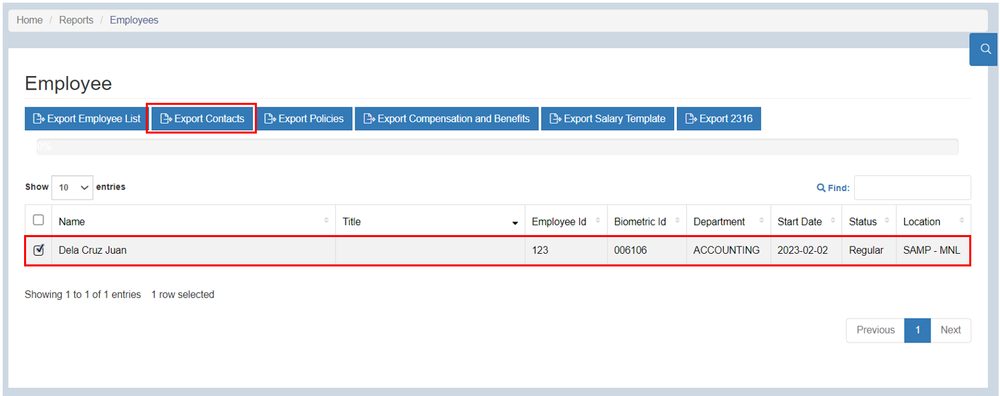
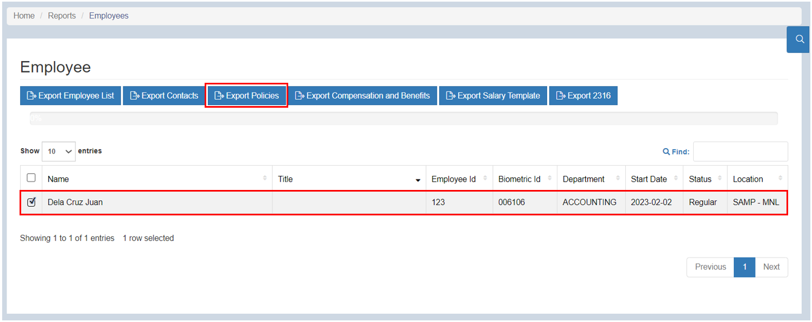
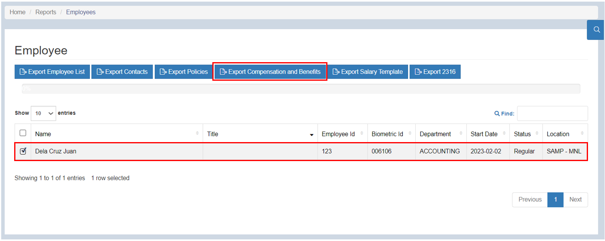
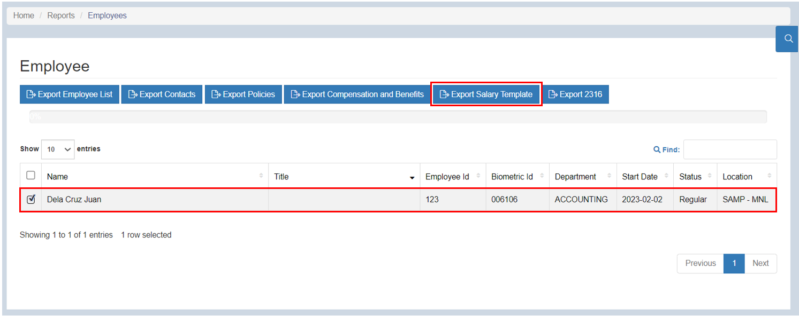

## Export Employee Reports

### Overview

This page serves as a comprehensive guide on how to export employee reports. By following these step-by-step instructions, users will be able to navigate the reporting functionality, select the desired report parameters, and generate comprehensive reports containing employee information.

### Step 1: Navigate to the Page
To navigate to the page:

&nbsp;&nbsp;&nbsp;&nbsp;&nbsp;&nbsp;&nbsp;&nbsp;&nbsp;&nbsp;&nbsp;**➥** Click on the **`Reports`** dropdown button.

&nbsp;&nbsp;&nbsp;&nbsp;&nbsp;&nbsp;&nbsp;&nbsp;&nbsp;&nbsp;&nbsp;**➥** Select **`Employee`**.

### Step 2: Search by Filter
To filter the list:

&nbsp;&nbsp;&nbsp;&nbsp;&nbsp;&nbsp;&nbsp;&nbsp;&nbsp;&nbsp;&nbsp;**➥** Click on the **`🔍`** (filter) button.

&nbsp;&nbsp;&nbsp;&nbsp;&nbsp;&nbsp;&nbsp;&nbsp;&nbsp;&nbsp;&nbsp;**➥** Select the **Company name** and select the **group name** where the employee belongs.

&nbsp;&nbsp;&nbsp;&nbsp;&nbsp;&nbsp;&nbsp;&nbsp;&nbsp;&nbsp;&nbsp;**➥** Click the **`Search`** button to view the list.

:::info INFORMATION

If there is a huge number of employees, you can simply **enter the employee's name in the search bar** after filtering.

:::

### Step 3: Exporting

import Tabs from '@theme/Tabs';
import TabItem from '@theme/TabItem';

<Tabs>
  <TabItem value="EmpList" label="Employee List" default>

To export employee list:

&nbsp;&nbsp;&nbsp;&nbsp;&nbsp;&nbsp;&nbsp;&nbsp;&nbsp;&nbsp;&nbsp;**➥** Select the employees that you want to see in a list with their data.

&nbsp;&nbsp;&nbsp;&nbsp;&nbsp;&nbsp;&nbsp;&nbsp;&nbsp;&nbsp;&nbsp;**➥** Click the **`Export Employee List`** button to export the list of employees with their data in an Excel file.

:::tip SUCCESS

Congratulations! You have successfully exported an **Employee List** Report

:::
  </TabItem>
  <TabItem value="Contacts" label="Contacts">

To export Contact Details:

&nbsp;&nbsp;&nbsp;&nbsp;&nbsp;&nbsp;&nbsp;&nbsp;&nbsp;&nbsp;&nbsp;**➥** Select the employees for whom you want to export the contact details.

&nbsp;&nbsp;&nbsp;&nbsp;&nbsp;&nbsp;&nbsp;&nbsp;&nbsp;&nbsp;&nbsp;**➥** Click **`Export Contacts`** button to export the Contact details of selected employees.

:::tip SUCCESS

Congratulations! You have successfully exported an **Employee's Contact Information** Report

:::

  </TabItem>
  <TabItem value="Policies" label="Policies">

To export Policy Details:

&nbsp;&nbsp;&nbsp;&nbsp;&nbsp;&nbsp;&nbsp;&nbsp;&nbsp;&nbsp;&nbsp;**➥** Select the employees for whom you want to export the policy details.

&nbsp;&nbsp;&nbsp;&nbsp;&nbsp;&nbsp;&nbsp;&nbsp;&nbsp;&nbsp;&nbsp;**➥** Click **`Export Policies`** button to export the Policy details of selected employees.

:::tip SUCCESS

Congratulations! You have successfully exported an **Employee's Policies** Report

:::

  </TabItem>
  <TabItem value="Com&Ben" label="Compensation & Benefits">

To export Compensation and Benefits Details:

&nbsp;&nbsp;&nbsp;&nbsp;&nbsp;&nbsp;&nbsp;&nbsp;&nbsp;&nbsp;&nbsp;**➥** SSelect the employees for whom you want to export the compensation and benefits details.

&nbsp;&nbsp;&nbsp;&nbsp;&nbsp;&nbsp;&nbsp;&nbsp;&nbsp;&nbsp;&nbsp;**➥** Click the **`Export Compensation & Benefits`** button to export the compensation and benefits details of the selected employees.

:::tip SUCCESS

Congratulations! You have successfully exported an **Employee's Compensation and Benefits** Report

:::

  </TabItem>
  <TabItem value="Salary" label="Salary Template">

To export Salary Details:

&nbsp;&nbsp;&nbsp;&nbsp;&nbsp;&nbsp;&nbsp;&nbsp;&nbsp;&nbsp;&nbsp;**➥** Select the employees for whom you want to export the salary details.

&nbsp;&nbsp;&nbsp;&nbsp;&nbsp;&nbsp;&nbsp;&nbsp;&nbsp;&nbsp;&nbsp;**➥** Click the **`Export Salary Template`** button to export the salary template of the selected employees.

:::tip SUCCESS

Congratulations! You have successfully exported an **Employee's Salary Template** Report

:::

  </TabItem>
  <TabItem value="2316" label="2316">

To export 2316 Details:

&nbsp;&nbsp;&nbsp;&nbsp;&nbsp;&nbsp;&nbsp;&nbsp;&nbsp;&nbsp;&nbsp;**➥** Select the employees for whom you want to export the 2316 details.

&nbsp;&nbsp;&nbsp;&nbsp;&nbsp;&nbsp;&nbsp;&nbsp;&nbsp;&nbsp;&nbsp;**➥** Click **`Export 2316`** button to export the 2316 details of selected employees.

:::tip SUCCESS

Congratulations! You have successfully exported a **2316** Report.

:::

  </TabItem>
</Tabs>

