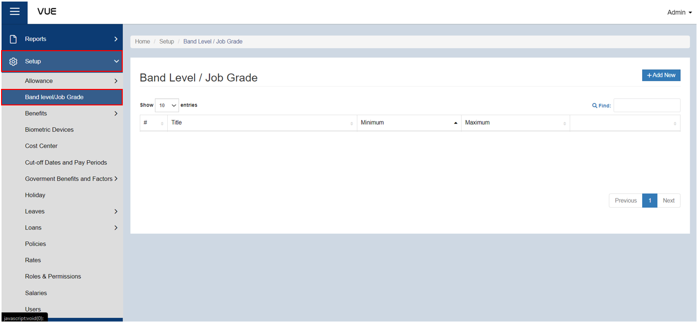
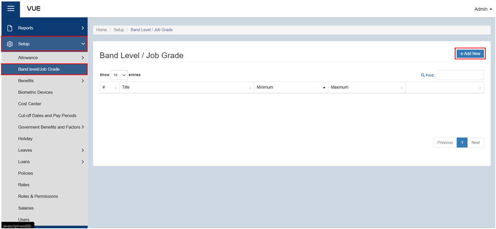
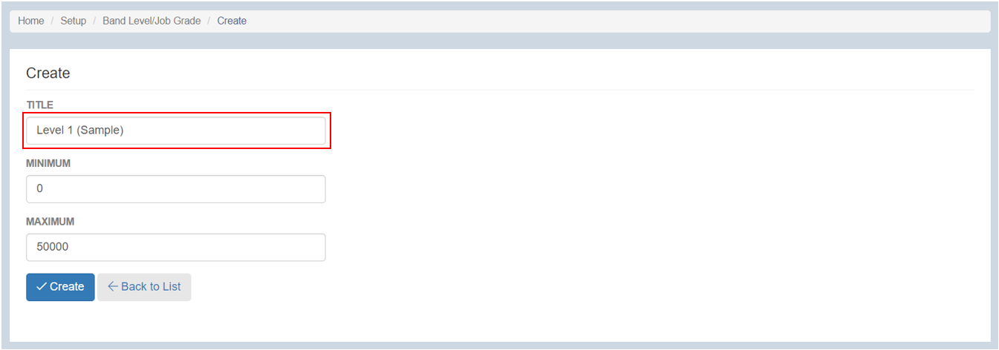
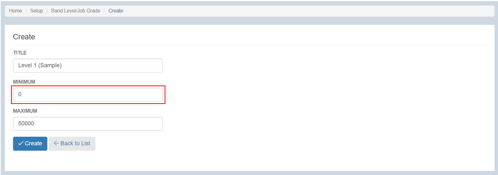
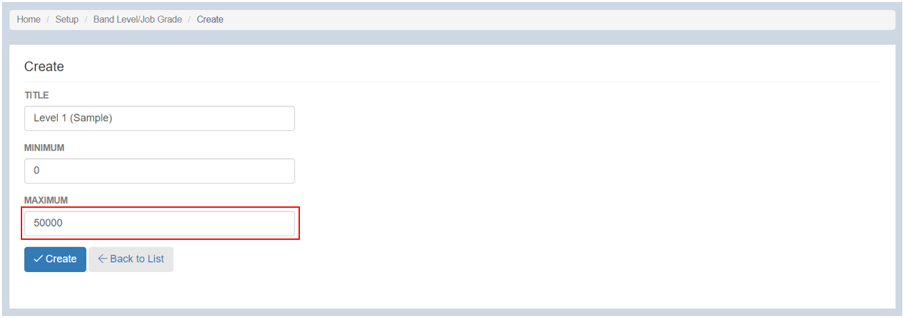
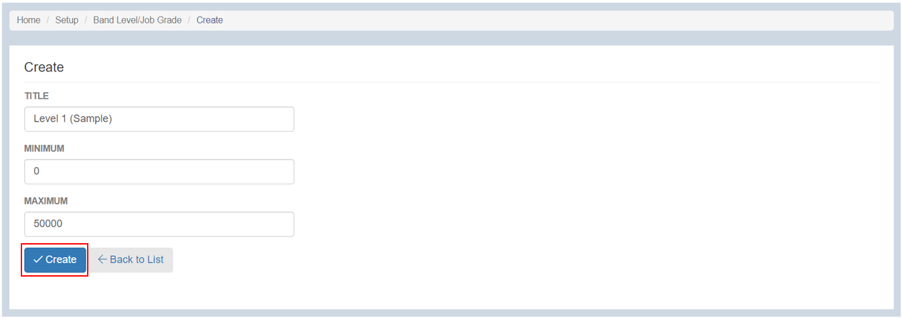

## Setup Band Level / Job Grade

### Overview

This page serves as a comprehensive guide on how to set up band levels or job grades within an organizational structure. By following these step-by-step instructions, users will be able to effectively define and configure band levels or job grades, and assign them to employees.

### Step 1: Navigate to the Page
To navigate to the page, follow these steps:

&nbsp;&nbsp;&nbsp;&nbsp;&nbsp;&nbsp;&nbsp;&nbsp;&nbsp;&nbsp;&nbsp;**➥** Click on the **`Setup`** dropdown button.

&nbsp;&nbsp;&nbsp;&nbsp;&nbsp;&nbsp;&nbsp;&nbsp;&nbsp;&nbsp;&nbsp;**➥** Select **`Band Level/Job Grade`**.

You will be directed to the **Band Leve/Job Grade Page**. 

### Step 2: Adding a New Band Level/Job Grade

  
Band Level & Job Grade

    
In the Philippines, many companies use a banding or job grading system to classify and assign positions. However, specific band levels and job grades can vary depending on the company and industry. This is a sample of Band Level or Job Grade use in the Philippines. Please note that this is not an exhaustive list and may not apply to every company.

**Band Level 1 / Job Grade 1:**
- Entry-level positions
- Fresh graduates or individuals with minimal work experience
- Junior or assistant roles

**Band Level 2 / Job Grade 2:**
- Some work experience required
- Associate or support roles
- Typically handles basic tasks and responsibilities

**Band Level 3 / Job Grade 3:**
- Intermediate positions
- Mid-level professionals with several years of experience
- Responsibilities often involve independent work and decision-making

**Band Level 4 / Job Grade 4:**
- Experienced professionals
- Supervisory or team lead positions
- May have managerial responsibilities for a small team

**Band Level 5 / Job Grade 5:**
- Senior-level roles
- Managers or department heads
- Responsible for strategic decision-making and overseeing larger teams

**Band Level 6 / Job Grade 6:**
- Executive-level positions
- Directors or top-level management
- Responsible for overall business operations and decision-making

It's important to note that different organizations may have their own unique banding or job grading structures. Additionally, the specific titles and responsibilities associated with each band level or job grade can vary. It's best to consult individual companies or their HR departments for accurate and up-to-date information regarding their banding and grading systems.

To add a new band level or jb grade, follow these steps:

&nbsp;&nbsp;&nbsp;&nbsp;&nbsp;&nbsp;&nbsp;&nbsp;&nbsp;&nbsp;&nbsp;**➥** Click on the **`Add New`** button.

&nbsp;&nbsp;&nbsp;&nbsp;&nbsp;&nbsp;&nbsp;&nbsp;&nbsp;&nbsp;&nbsp;**➥** Input a **Title** for this band level or job grade.

&nbsp;&nbsp;&nbsp;&nbsp;&nbsp;&nbsp;&nbsp;&nbsp;&nbsp;&nbsp;&nbsp;**➥** Input the **Minimum Amount** of salary for this band level.

&nbsp;&nbsp;&nbsp;&nbsp;&nbsp;&nbsp;&nbsp;&nbsp;&nbsp;&nbsp;&nbsp;**➥** Input the **Maximum Amount** of salary for this band level.

### Step 3: Saving

&nbsp;&nbsp;&nbsp;&nbsp;&nbsp;&nbsp;&nbsp;&nbsp;&nbsp;&nbsp;&nbsp;**➥** Click the **`Create`** button to complete the creation process.

:::tip SUCCESS

Congratulations! You have successfully setup  a **Band Level / Job Grade**.

<!-- #### NEXT STEP...

- You can now add a **Salary** to an Employee.
- Click the **`Next`** button for the next instruction. -->

:::