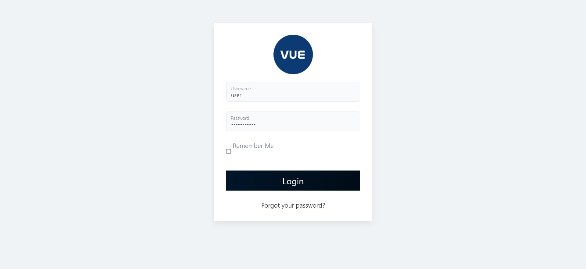

## How to Log in

### Overview

The login page of VUE HR is where users can access their account by entering their unique login credentials. To log in, users typically need to provide their username and password. Once the correct credentials are entered, the user is granted access to their account where they can view their personalized content or perform various other actions. 

:::info

It's important to keep login credentials secure and not share them with anyone else to protect personal information and prevent unauthorized access to the account.

:::

### Step 1: Log in your account.

To log in to your account, follow these steps:

&nbsp;&nbsp;&nbsp;&nbsp;&nbsp;&nbsp;&nbsp;&nbsp;&nbsp;&nbsp;&nbsp;**➥** Open **VUE HR.**

&nbsp;&nbsp;&nbsp;&nbsp;&nbsp;&nbsp;&nbsp;&nbsp;&nbsp;&nbsp;&nbsp;**➥** Input your **username** and **password.**

&nbsp;&nbsp;&nbsp;&nbsp;&nbsp;&nbsp;&nbsp;&nbsp;&nbsp;&nbsp;&nbsp;**➥** Click **`Log in`** button.

**➥**  Once you have successfully logged in, you will be directed to the **Homepage** where you can find the menu located in the left corner. This menu consists of sections, and each one has dropdowns for subpages.

:::tip NEXT STEP...

- You can now start exploring the **VUE HR!** 
- Click the **`Next`** button for the next instruction.

:::

