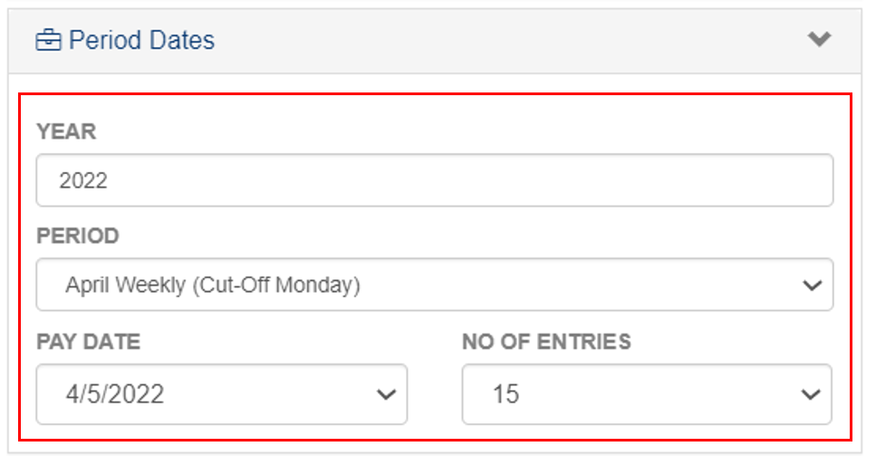

## Processing under Payroll

### Overview

This set of instructions provides a step-by-step guide for processing payroll for an employee's salary. The process involves selecting the employee, verifying their salary rate and period, and generating the payroll report.

### Step 1: Go to the Processing Page
To navigate to the Processing Page under Payroll, follow these steps:

&nbsp;&nbsp;&nbsp;&nbsp;&nbsp;&nbsp;&nbsp;&nbsp;&nbsp;&nbsp;&nbsp;**➥** Click on the **`Timekeeping and Payroll`** dropdown button.

&nbsp;&nbsp;&nbsp;&nbsp;&nbsp;&nbsp;&nbsp;&nbsp;&nbsp;&nbsp;&nbsp;**➥** Select **`Payroll`**.

&nbsp;&nbsp;&nbsp;&nbsp;&nbsp;&nbsp;&nbsp;&nbsp;&nbsp;&nbsp;&nbsp;**➥** Click on **`Processing`**.

You will be directed to the **Processing Page** where you can see the Payroll Processing of Employees.

### Step 2: Searching for Group/Employee
To filter the list:

&nbsp;&nbsp;&nbsp;&nbsp;&nbsp;&nbsp;&nbsp;&nbsp;&nbsp;&nbsp;&nbsp;**➥** Click on the **`🔍`** (filter) button.

&nbsp;&nbsp;&nbsp;&nbsp;&nbsp;&nbsp;&nbsp;&nbsp;&nbsp;&nbsp;&nbsp;**➥** In **Organization Info**, select the **Company**.

&nbsp;&nbsp;&nbsp;&nbsp;&nbsp;&nbsp;&nbsp;&nbsp;&nbsp;&nbsp;&nbsp;**➥** In **Employee Details**, input the name and Id of an employee whose salary will be processed.

&nbsp;&nbsp;&nbsp;&nbsp;&nbsp;&nbsp;&nbsp;&nbsp;&nbsp;&nbsp;&nbsp;**➥** In **Period Dates**, input the year.

&nbsp;&nbsp;&nbsp;&nbsp;&nbsp;&nbsp;&nbsp;&nbsp;&nbsp;&nbsp;&nbsp;**➥** Select **Period**.

:::info INFORMATION

**Paydate and Number of entries** will adjust depending on the selection.

You will be prompted with the **Payroll Processing Page.**

:::

:::tip TIP

Click on the **TABS** to read the instructions for **Time Record, Payroll, and  Payroll-Released.**

:::

import Tabs from '@theme/Tabs';
import TabItem from '@theme/TabItem';

### Step 3: Releasing Payroll
<Tabs className="unique-tabs">
<TabItem value="Time Record">

#### Time Records

&nbsp;&nbsp;&nbsp;&nbsp;&nbsp;&nbsp;&nbsp;&nbsp;&nbsp;&nbsp;&nbsp;**➥** Select the name of Employee.

&nbsp;&nbsp;&nbsp;&nbsp;&nbsp;&nbsp;&nbsp;&nbsp;&nbsp;&nbsp;&nbsp;**➥** Click **`Generate Pay`** button to proceed with the payroll.

&nbsp;&nbsp;&nbsp;&nbsp;&nbsp;&nbsp;&nbsp;&nbsp;&nbsp;&nbsp;&nbsp;**➥** Click **`Export DTR`** button.

&nbsp;&nbsp;&nbsp;&nbsp;&nbsp;&nbsp;&nbsp;&nbsp;&nbsp;&nbsp;&nbsp;**➥** You can view the **Timekeeping Breakdown Summary Report** for an Employee in **PDF Format**.

:::info INFORMATION

Scroll up and click the **`Payroll`** tab to read the next instructions.

:::
</TabItem>
<TabItem value="Payroll">

#### Payroll

&nbsp;&nbsp;&nbsp;&nbsp;&nbsp;&nbsp;&nbsp;&nbsp;&nbsp;&nbsp;&nbsp;**➥** Click on the **`Payroll`** tab.

&nbsp;&nbsp;&nbsp;&nbsp;&nbsp;&nbsp;&nbsp;&nbsp;&nbsp;&nbsp;&nbsp;**➥** Select the **posted** Employee

&nbsp;&nbsp;&nbsp;&nbsp;&nbsp;&nbsp;&nbsp;&nbsp;&nbsp;&nbsp;&nbsp;**➥** Click on **`Release`** button to release the payroll record.

:::caution REMEMBER

You can no longer undo this action once the Payroll is released.

:::

&nbsp;&nbsp;&nbsp;&nbsp;&nbsp;&nbsp;&nbsp;&nbsp;&nbsp;&nbsp;&nbsp;**➥** Click on **`Export`** button to view the payroll record in **PDF format.**

&nbsp;&nbsp;&nbsp;&nbsp;&nbsp;&nbsp;&nbsp;&nbsp;&nbsp;&nbsp;&nbsp;**➥** Click **`Export`** button to view the payroll record in **Excel format.**

:::info INFORMATION

Scroll up and click the **`Payroll Released`** tab to read the next instructions.

:::
</TabItem>
<TabItem value="Payroll-Released">

#### Payroll Released

&nbsp;&nbsp;&nbsp;&nbsp;&nbsp;&nbsp;&nbsp;&nbsp;&nbsp;&nbsp;&nbsp;**➥** Click on the **`Payroll-Released`** tab.

&nbsp;&nbsp;&nbsp;&nbsp;&nbsp;&nbsp;&nbsp;&nbsp;&nbsp;&nbsp;&nbsp;**➥** Click on **`Export`** to view the payroll record in **PDF format**.

&nbsp;&nbsp;&nbsp;&nbsp;&nbsp;&nbsp;&nbsp;&nbsp;&nbsp;&nbsp;&nbsp;**➥** Click on **`Export`** to view the payroll record in **Excel format**.

:::tip SUCCESS

**Congratulations!** You have successfully finished the process. 

:::
</TabItem>
</Tabs>

### Step 4: View Payslip

&nbsp;&nbsp;&nbsp;&nbsp;&nbsp;&nbsp;&nbsp;&nbsp;&nbsp;&nbsp;&nbsp;**➥** In the **`Payroll`** tab, click on the **name of employee** to view the payslip.

**Example of Generated Payslip**

<!-- 

  
Terms in Processing Timekeeping and Payroll

  

    
Total Days Present

    
Total Days Present refers to the total number of days that an employee has reported to work during a specific time period, such as a month or a year.

    
Absences

    
Absences refer to the number of days an employee is not present at work due to sickness, vacation, or other reasons.

    
Paid Leaves

    
Paid Leaves refer to the number of days an employee is allowed to take off from work with pay, such as sick leave, vacation leave, and personal days.

    
Unpaid Leaves

    
DUnpaid Leaves refer to the number of days an employee takes off from work without pay, such as extended personal leave or maternity leave.

    
Total Working Hours

    
Total Working Hours refer to the total number of hours an employee has worked during a specific time period, such as a week or a month.

    
OT/Absences Hrs

    
OT/Absences Hrs refer to the number of hours an employee has worked overtime or has been absent from work during a specific time period.

    
Late Mins

    
Late Mins refer to the number of minutes an employee arrives late for work.

    
UT Mins

    
UT Mins refer to the number of minutes an employee leaves work earlier than scheduled.

    
OvrBrk Mins

    
OvrBrk Mins refer to the number of minutes an employee takes for a break longer than the allotted time.

    
OT Mins

    
OT Mins refer to the number of minutes an employee has worked overtime during a specific time period.

    
NDF Mins

    
Definition

    
NDFOT Mins

    
Definition

    
RD Mins

    
Definition

    
RDOT Mins

    
Definition

    
RDNDF Mins

    
Definition

    
RDNDFOT Mins

    
Definition

    
RH Mins

    
Definition

    
RHOT Mins

    
Definition

    
RHNDF Mins

    
Definition

    
RHRD Mins

    
Definition

    
RHRDNDF Mins

    
Definition

    
RHRDOT Mins

    
Definition

    
RHRDNDFOT Mins

    
Definition

    
SH Mins

    
Definition

    
SHOT Mins

    
Definition

    
SHNDF Mins

    
Definition

    
SHNDFOT Mins

    
Definition

    
SHRD Mins

    
Definition

    
SHRDNDF Mins

    
Definition

    
SHRDOT Mins

    
Definition

    
Basepay

    
Definition

    
Deductions

    
Definition

    
OT

    
Definition

    
NDF

    
Definition

    
NDFOT

    
Definition

    
RD/Holiday

    
Definition

    
Total Benefits

    
Definition

    
Gross Pay

    
Definition

    
Total Allowance

    
Definition

    
SSS

    
Definition

    
Philhealth

    
Definition

    
Pagibig

    
Definition

    
W/Tax

    
Definition

    
Total Loans

    
Definition

    
Bonuses & Incentives

    
Definition

    
Other Deductions

    
Definition

    
Net Pay

    
Definition

     
  

 -->

