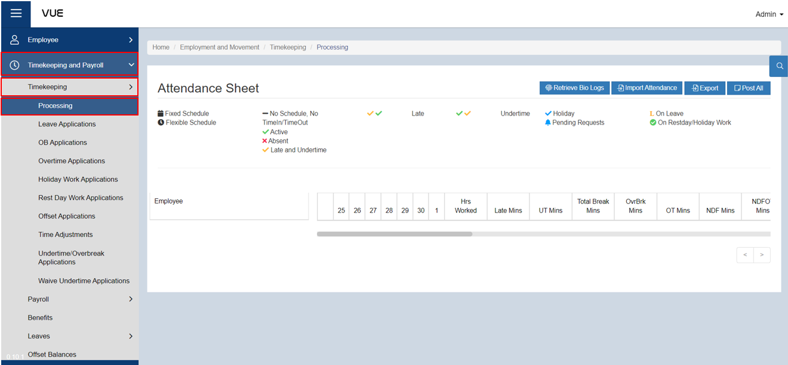
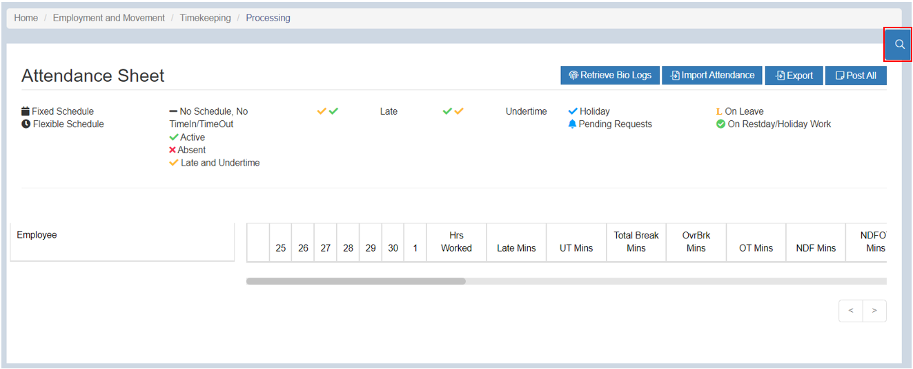
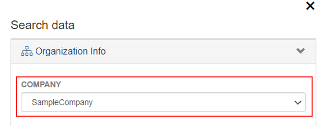
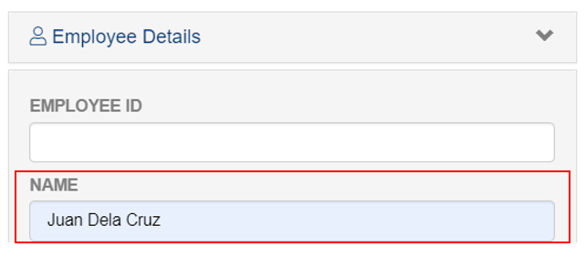
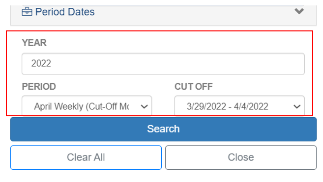
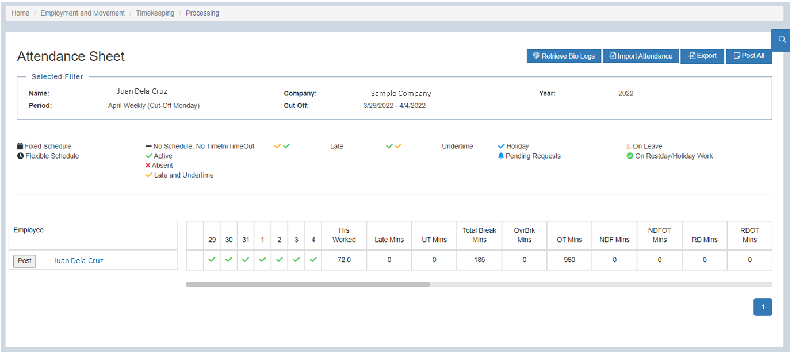
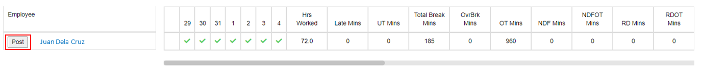
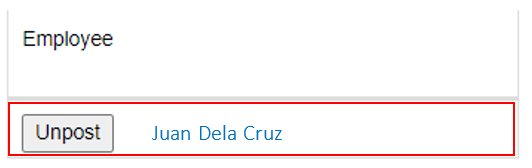

## Processing under Timekeeping

### Overview

This set of instructions provides a step-by-step guide for managing timekeeping in the company. The process involves generating payroll reports.

:::tip REMEMBER

Before processing a salary of an employee, make sure that the **Policy** is already set up. If not, follow the instructions in the link below to create one.

:::

&nbsp;&nbsp;&nbsp;&nbsp;&nbsp;&nbsp;&nbsp;&nbsp;&nbsp;&nbsp;&nbsp;**➤** [Setup Policies](./Create-Policies.md)

### Step 1: Go to the Processing Page
To navigate to the Processing Page under Timekeeping, follow these steps:

&nbsp;&nbsp;&nbsp;&nbsp;&nbsp;&nbsp;&nbsp;&nbsp;&nbsp;&nbsp;&nbsp;**➥** Click on the **`Timekeeping and Payroll`** dropdown button.

&nbsp;&nbsp;&nbsp;&nbsp;&nbsp;&nbsp;&nbsp;&nbsp;&nbsp;&nbsp;&nbsp;**➥** Select **`Timekeeping`**.

&nbsp;&nbsp;&nbsp;&nbsp;&nbsp;&nbsp;&nbsp;&nbsp;&nbsp;&nbsp;&nbsp;**➥** Click on **`Processing`**.

You will be directed to the **Processing Page** where you can see the Attendance Sheet of Employees.

### Step 2: Searching for Group/Employee
To filter the list:

&nbsp;&nbsp;&nbsp;&nbsp;&nbsp;&nbsp;&nbsp;&nbsp;&nbsp;&nbsp;&nbsp;**➥** Click on the **`Filter`** button.

&nbsp;&nbsp;&nbsp;&nbsp;&nbsp;&nbsp;&nbsp;&nbsp;&nbsp;&nbsp;&nbsp;**➥** In **Organization Info**, select the **Company**.

&nbsp;&nbsp;&nbsp;&nbsp;&nbsp;&nbsp;&nbsp;&nbsp;&nbsp;&nbsp;&nbsp;**➥** In **Employee Details**, input the name and Id of an employee whose salary will be processed.

&nbsp;&nbsp;&nbsp;&nbsp;&nbsp;&nbsp;&nbsp;&nbsp;&nbsp;&nbsp;&nbsp;**➥** In **Period Dates**, input the year.

&nbsp;&nbsp;&nbsp;&nbsp;&nbsp;&nbsp;&nbsp;&nbsp;&nbsp;&nbsp;&nbsp;**➥** Select **Period**.

&nbsp;&nbsp;&nbsp;&nbsp;&nbsp;&nbsp;&nbsp;&nbsp;&nbsp;&nbsp;&nbsp;**➥** Select **Cut-off**.

&nbsp;&nbsp;&nbsp;&nbsp;&nbsp;&nbsp;&nbsp;&nbsp;&nbsp;&nbsp;&nbsp;**➥** Then, click the **`Search`** button.

You will be prompted with Attendance details of an Employee.

:::info INFORMATION

If you want to search for a group of employee, you can select the **Company** in **Organization Info** and select the group.

:::

### Step 3: Posting
In able to process the payroll of an employee:

&nbsp;&nbsp;&nbsp;&nbsp;&nbsp;&nbsp;&nbsp;&nbsp;&nbsp;&nbsp;&nbsp;**➥** Click Post button to post employee DTR.

<!-- :::tip SUCCESS

**Congratulations!** You have successfully finished the process. 

#### NEXT STEP...

- You can now create a process under **Payroll**.
- Click the **`Next`** button for the next instruction.

::: -->
