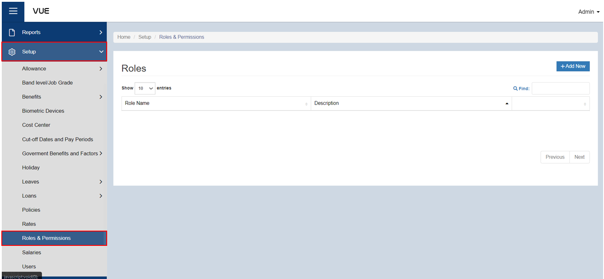
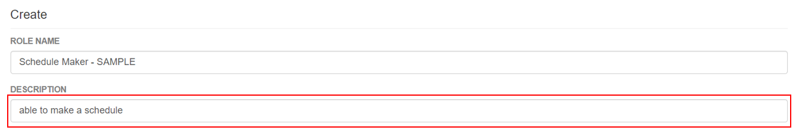
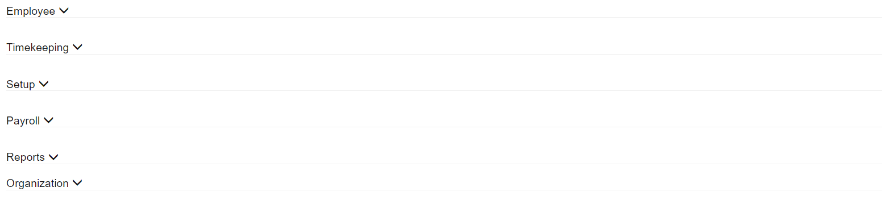

## Setup Roles and Permissions

### Overview

This page provides a comprehensive guide on how to set up roles and permissions. By following these step-by-step instructions, users will be able to effectively manage and assign roles to individuals, define their permissions, and control access to various features and functionalities.

:::tip

Please remember that there are **default** and **custom** roles. The **default roles**, such as Administrator, HR, MSS, and MSS_ESS, already have pre-set permissions. On the other hand, **custom roles** allow you to modify and restrict the pages that they can view, edit, export, import, and more.

These instructions are for setting up a **custom role**.

:::

### Step 1: Navigate to the Page
To navigate to the page, follow these steps:

&nbsp;&nbsp;&nbsp;&nbsp;&nbsp;&nbsp;&nbsp;&nbsp;&nbsp;&nbsp;&nbsp;**➥** Click on the **`Setup`** dropdown button.

&nbsp;&nbsp;&nbsp;&nbsp;&nbsp;&nbsp;&nbsp;&nbsp;&nbsp;&nbsp;&nbsp;**➥** Select **`Roles & Permissions`**.

You will be directed to the **Roles & Permissions Page**. 

### Step 2: Adding a New Role
To add a new role, follow these steps:

&nbsp;&nbsp;&nbsp;&nbsp;&nbsp;&nbsp;&nbsp;&nbsp;&nbsp;&nbsp;&nbsp;**➥** Click on the **`Add New`** button.

&nbsp;&nbsp;&nbsp;&nbsp;&nbsp;&nbsp;&nbsp;&nbsp;&nbsp;&nbsp;&nbsp;**➥** Input a **Name** for the Role.

&nbsp;&nbsp;&nbsp;&nbsp;&nbsp;&nbsp;&nbsp;&nbsp;&nbsp;&nbsp;&nbsp;**➥** Input a **Description** for the Role.

### Step 2: Setting up Permissions
To setup its permissions, follow these steps:

You will see a dropdown for every sections of Employee, Timekeeping, Setup, Payroll, Reports, and Organization. 

&nbsp;&nbsp;&nbsp;&nbsp;&nbsp;&nbsp;&nbsp;&nbsp;&nbsp;&nbsp;&nbsp;**➥** Click on the **`dropdown`** of every section that the Role is allowed to View.

&nbsp;&nbsp;&nbsp;&nbsp;&nbsp;&nbsp;&nbsp;&nbsp;&nbsp;&nbsp;&nbsp;**➥** Put a **Check** for the pages or sections that the Role is allowed to View or Edit.

  
Employees

    
Under the Employee dropdown, you can check the permissions that you want to apply to the specific role.

  
Timekeeping

    
Under the Timekeeping dropdown, you can check the permissions that you want to apply to the specific role.

  
Setup

    
Under the Setup dropdown, you can check the permissions that you want to apply to the specific role.

  
Payroll

    
Under the Payroll dropdown, you can check the permissions that you want to apply to the specific role.

  
Reports

    
Under the Reports dropdown, you can check the permissions that you want to apply to the specific role.

  
Organization

    
Under the Organizations dropdown, you can check the permissions that you want to apply to the specific role.

### Step 3: Setup which group will be viewed

In able to use the setup permissions, select the necessary sections in which you want it to apply the set permissions.

&nbsp;&nbsp;&nbsp;&nbsp;&nbsp;&nbsp;&nbsp;&nbsp;&nbsp;&nbsp;&nbsp;**➥** Click the **`Add`** button to select a Company, Department, Location, Division, Position, and Custom Group. 

### Step 4: Saving

&nbsp;&nbsp;&nbsp;&nbsp;&nbsp;&nbsp;&nbsp;&nbsp;&nbsp;&nbsp;&nbsp;**➥** Click the **`Create`** button to complete the creation process.

:::tip SUCCESS

Congratulations! You have successfully setup a **Roles and Permissions**.

<!-- #### NEXT STEP...

- You can now add a **Salary** to an Employee.
- Click the **`Next`** button for the next instruction. -->

:::