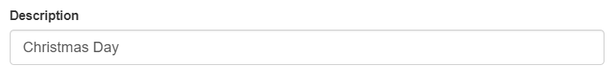

## Setting up Holidays

### Overview

This page provides a clear and concise step-by-step procedure on how to add a holiday to a calendar or scheduling system. From regular national celebrations to special occasions unique to the region or organization, follow the outlined steps to ensure accurate and up-to-date holiday information. 

### Step 1: Navigate to the Page
To navigate to the Holiday Page, follow these steps:

&nbsp;&nbsp;&nbsp;&nbsp;&nbsp;&nbsp;&nbsp;&nbsp;&nbsp;&nbsp;&nbsp;**➥** Click on the **`Setup`** dropdown button.

&nbsp;&nbsp;&nbsp;&nbsp;&nbsp;&nbsp;&nbsp;&nbsp;&nbsp;&nbsp;&nbsp;**➥** Select **`Holiday`**.

You will be directed to the **Holiday Page** where you can see the list of **Holidays** with the description, location, date, and type.

### Step 2: Adding a New Holiday
To create a new Holiday, follow these steps:

&nbsp;&nbsp;&nbsp;&nbsp;&nbsp;&nbsp;&nbsp;&nbsp;&nbsp;&nbsp;&nbsp;**➥** Click on the **`Add New Holiday`** button.

&nbsp;&nbsp;&nbsp;&nbsp;&nbsp;&nbsp;&nbsp;&nbsp;&nbsp;&nbsp;&nbsp;**➥** Input the **description** of the **Holiday**.

&nbsp;&nbsp;&nbsp;&nbsp;&nbsp;&nbsp;&nbsp;&nbsp;&nbsp;&nbsp;&nbsp;**➥** Input the **month, date, & year**.

&nbsp;&nbsp;&nbsp;&nbsp;&nbsp;&nbsp;&nbsp;&nbsp;&nbsp;&nbsp;&nbsp;**➥** Select the **type** if its regular os special.

:::info INFORMATION

A **regular holiday** is a recurring holiday that is observed annually or on a fixed schedule. It is typically established by law or government regulations and is commonly observed by the general population. **Regular holidays** are often predetermined and can include significant events or national celebrations. Examples of regular holidays: 
- New Year's Day
- Christmas Day
- Independence Day
- Labor Day

These holidays are widely recognized and are typically granted as days off from work.

A **special holiday**, also known as an exceptional holiday, is a holiday that is declared or observed for a specific purpose or occasion. Unlike regular holidays, special holidays are not part of the standard annual holiday calendar. Special holidays can be designated to honor a specific event, commemorate a historical milestone, or acknowledge a particular group or individual. These holidays may vary from one location to another and are often determined by local or regional authorities. Examples of special holidays include local festivals, religious observances, cultural celebrations, or tribute days for notable individuals.

:::

&nbsp;&nbsp;&nbsp;&nbsp;&nbsp;&nbsp;&nbsp;&nbsp;&nbsp;&nbsp;&nbsp;**➥** Select the **location** where the **Holiday** will be applied.

:::info INFORMATION

The selection of a holiday's location can vary depending on the nature of the holiday itself. In some cases, holidays may be exclusive to a specific location, while others can be universally observed.

For instance, let's consider "Laguna Day." This holiday is designed to commemorate a significant event or celebrate the culture and heritage of the Laguna region. Since it is specifically associated with Laguna, it is typically observed exclusively by individuals working or residing in that particular location. Employees who work within Laguna would be eligible for time off or special celebrations related to Laguna Day, while those outside the region may not be directly involved.

On the other hand, holidays such as Christmas Day have a widespread observance. Christmas is a widely celebrated holiday around the world, transcending geographical boundaries and cultural differences. It applies to people of different locations, religions, and backgrounds. Regardless of where one resides or works, Christmas Day is generally recognized as a public holiday, allowing individuals to take part in festive traditions and spend time with loved ones.

:::

### Step 3: Saving

&nbsp;&nbsp;&nbsp;&nbsp;&nbsp;&nbsp;&nbsp;&nbsp;&nbsp;&nbsp;&nbsp;**➥** Click the **`Create`** button to complete the creation process.

