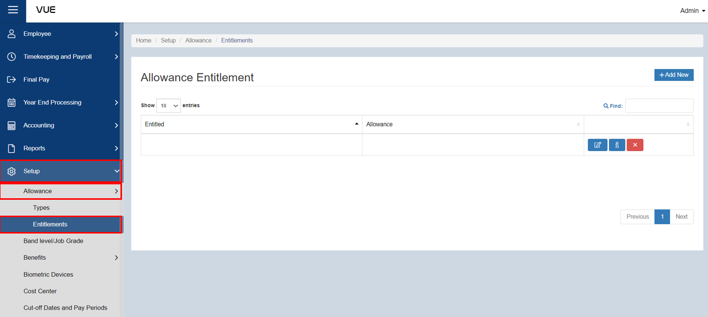

## Setting up Allowance Entitlement

Here are the step-by-step instructions for settig up **allowance entitlement**:

### Step 1: Go to Allowance - Entitlement Page

&nbsp;&nbsp;&nbsp;&nbsp;&nbsp;&nbsp;&nbsp;&nbsp;&nbsp;&nbsp;&nbsp;**➥** In the sidebar menu, click on **`Setup`**.

&nbsp;&nbsp;&nbsp;&nbsp;&nbsp;&nbsp;&nbsp;&nbsp;&nbsp;&nbsp;&nbsp;**➥** Click on **`Allowances`**.

&nbsp;&nbsp;&nbsp;&nbsp;&nbsp;&nbsp;&nbsp;&nbsp;&nbsp;&nbsp;&nbsp;**➥** Select **`Entitlements`**.

### Step 2: Adding New Benefit Entitlement

&nbsp;&nbsp;&nbsp;&nbsp;&nbsp;&nbsp;&nbsp;&nbsp;&nbsp;&nbsp;&nbsp;**➥** You will be directed to the **Allowance Entitlement Page**. Click the **`Add New`** button to create a new one.

&nbsp;&nbsp;&nbsp;&nbsp;&nbsp;&nbsp;&nbsp;&nbsp;&nbsp;&nbsp;&nbsp;**➥** A new empty row will be created. Click the **`Edit`** button.

&nbsp;&nbsp;&nbsp;&nbsp;&nbsp;&nbsp;&nbsp;&nbsp;&nbsp;&nbsp;&nbsp;**➥** Select which group of employee is entitled to receive the allowance.

&nbsp;&nbsp;&nbsp;&nbsp;&nbsp;&nbsp;&nbsp;&nbsp;&nbsp;&nbsp;&nbsp;**➥** Click **`Next`** button to proceed to the **`Allowance Type`** tab.

&nbsp;&nbsp;&nbsp;&nbsp;&nbsp;&nbsp;&nbsp;&nbsp;&nbsp;&nbsp;&nbsp;**➥** Select the desired **allowance type**.

### Step 3: Saving

&nbsp;&nbsp;&nbsp;&nbsp;&nbsp;&nbsp;&nbsp;&nbsp;&nbsp;&nbsp;&nbsp;**➥** Click the **`Apply`** button to complete the process.

:::tip SUCCESS

**Congratulations!** You have successfully added an **Allowance Entitlement**

#### NEXT STEP...

- Next step is to continue with the **Allowance Enrollment.**

- Click on **`Enroll for Allowance`** on the sidebar menu and proceed with the **Step 2**.

:::