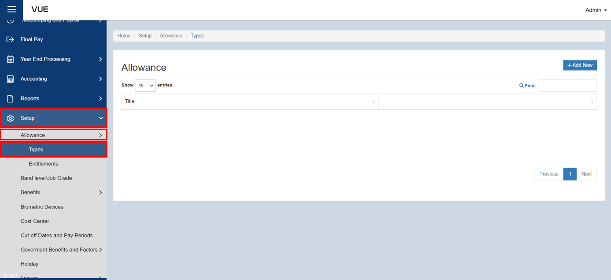
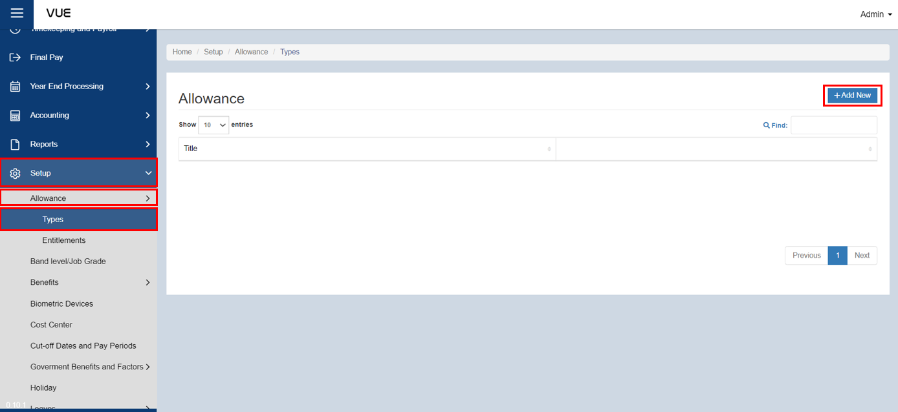
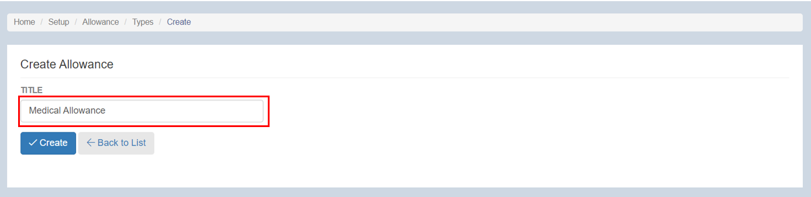
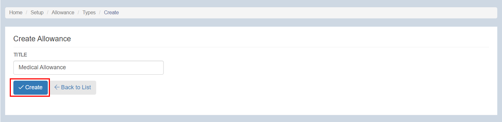

## Creating an Allowance Type

Here are the step-by-step instructions for creating a new **allowance type**:

### Step 1: Go to Allowances Page

&nbsp;&nbsp;&nbsp;&nbsp;&nbsp;&nbsp;&nbsp;&nbsp;&nbsp;&nbsp;&nbsp;**➥** In the sidebar menu, click on **`Setup`**.

&nbsp;&nbsp;&nbsp;&nbsp;&nbsp;&nbsp;&nbsp;&nbsp;&nbsp;&nbsp;&nbsp;**➥** Click on **`Allowances`**.

&nbsp;&nbsp;&nbsp;&nbsp;&nbsp;&nbsp;&nbsp;&nbsp;&nbsp;&nbsp;&nbsp;**➥** Select **`Types`**.

#### Step 2: Adding New Benefit Type

&nbsp;&nbsp;&nbsp;&nbsp;&nbsp;&nbsp;&nbsp;&nbsp;&nbsp;&nbsp;&nbsp;**➥** You will be directed to the **Allowance Page**. Click the **`Add New`** button to create a new one.

&nbsp;&nbsp;&nbsp;&nbsp;&nbsp;&nbsp;&nbsp;&nbsp;&nbsp;&nbsp;&nbsp;**➥** Input the **allowance title.**

:::info INFORMATION

Here are some common [**types of allowances**](../More/Allowance-Types.md) that employees may receive.

:::

### Step 3: Saving
&nbsp;&nbsp;&nbsp;&nbsp;&nbsp;&nbsp;&nbsp;&nbsp;&nbsp;&nbsp;&nbsp;**➥** Click the **`Create`** button to complete the adding process.

:::tip SUCCESS

**Congratulations!** You have successfully added an **Allowance type.**

#### NEXT STEP...

- You can now add an **Allowance Entitlement**.
- Click the **`Next`** button for the next instruction.

:::
