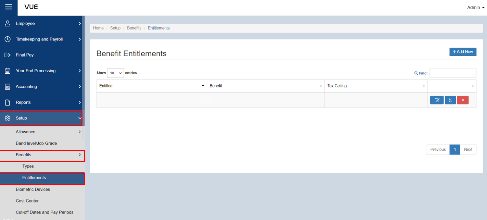
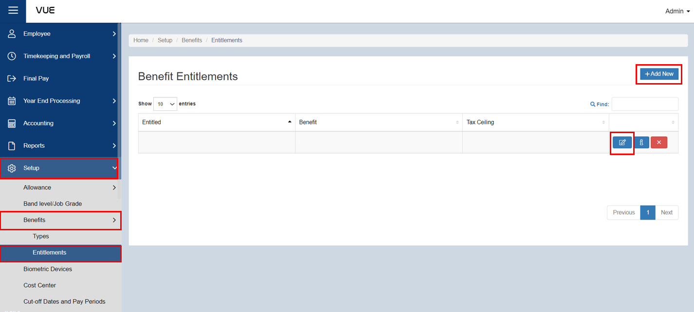
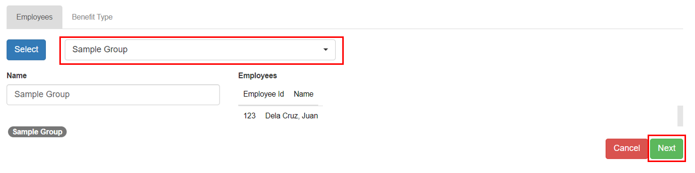
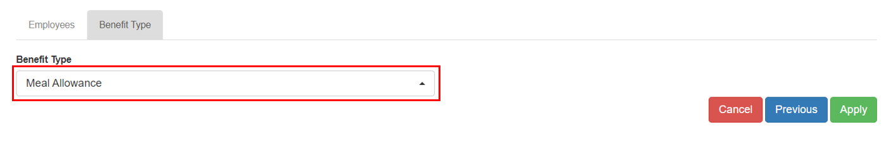
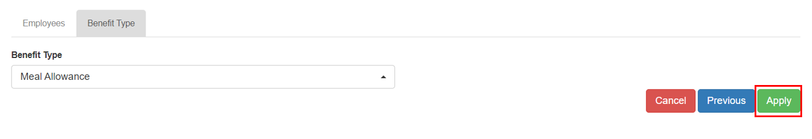

## Setting up Benefit Entitlement

Here are the step-by-step instructions for setting up **benefit entitlement**:

### Step 1: Go to Benefits - Entitlement Page

&nbsp;&nbsp;&nbsp;&nbsp;&nbsp;&nbsp;&nbsp;&nbsp;&nbsp;&nbsp;&nbsp;**➥** In the sidebar menu, click on **`Setup`**.

&nbsp;&nbsp;&nbsp;&nbsp;&nbsp;&nbsp;&nbsp;&nbsp;&nbsp;&nbsp;&nbsp;**➥** Click on **`Benefits`**.

&nbsp;&nbsp;&nbsp;&nbsp;&nbsp;&nbsp;&nbsp;&nbsp;&nbsp;&nbsp;&nbsp;**➥** Select **`Entitlements`**.

### Step 2: 
Adding New Benefit Entitlement
&nbsp;&nbsp;&nbsp;&nbsp;&nbsp;&nbsp;&nbsp;&nbsp;&nbsp;&nbsp;&nbsp;**➥** You will be directed to the **Benefits Entitlement Page**. Click the **`Add New`** button to create a new one.

&nbsp;&nbsp;&nbsp;&nbsp;&nbsp;&nbsp;&nbsp;&nbsp;&nbsp;&nbsp;&nbsp;**➥** A new empty row will be created. Click the **`Edit`** button.

&nbsp;&nbsp;&nbsp;&nbsp;&nbsp;&nbsp;&nbsp;&nbsp;&nbsp;&nbsp;&nbsp;**➥** Select which group of employee is entitled to receive the benefit.

&nbsp;&nbsp;&nbsp;&nbsp;&nbsp;&nbsp;&nbsp;&nbsp;&nbsp;&nbsp;&nbsp;**➥** Click on **`Next`** button to proceed to the **`Benefit Type`** tab.

&nbsp;&nbsp;&nbsp;&nbsp;&nbsp;&nbsp;&nbsp;&nbsp;&nbsp;&nbsp;&nbsp;**➥** Select the desired **benefit type**.

### Step 3: Saving
&nbsp;&nbsp;&nbsp;&nbsp;&nbsp;&nbsp;&nbsp;&nbsp;&nbsp;&nbsp;&nbsp;**➥** Click the **`Apply`** button to complete the process.

:::tip SUCCESS

**Congratulations!** You have successfully added a **Benefit Entitlement**

#### NEXT STEP...

- Next step is to continue with the **Benefit Enrollment.**

- Click on **`Enroll for a Benefit`** on the sidebar menu and proceed with the **Step 2**.

:::
