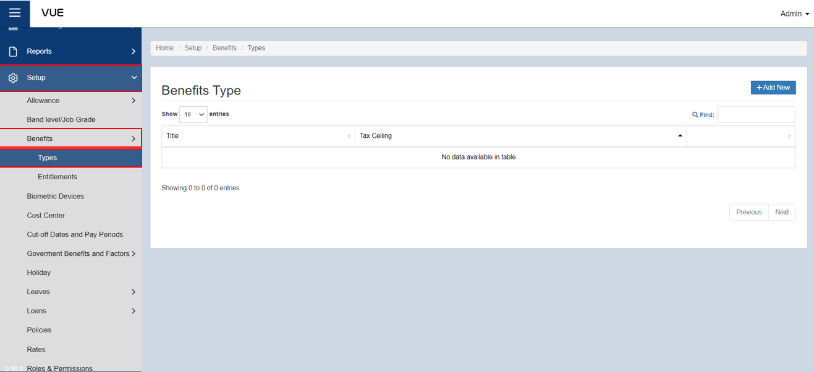
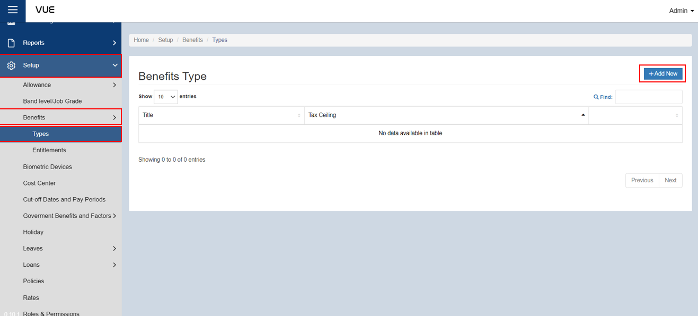
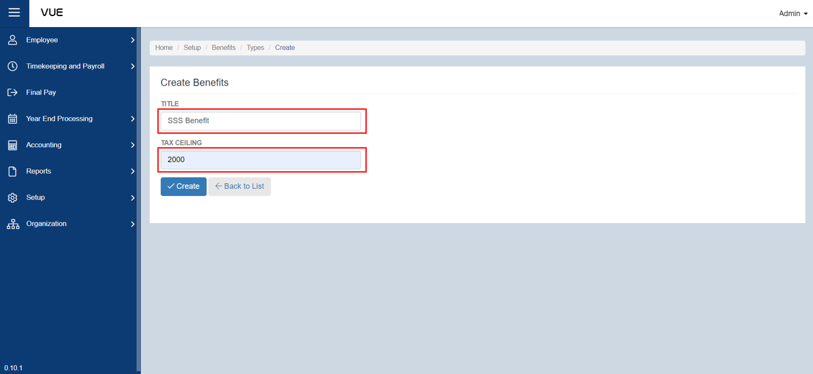
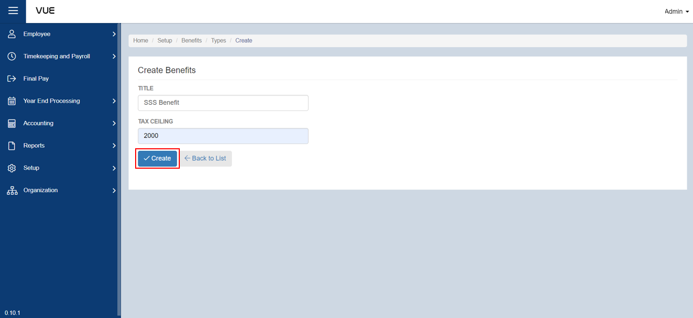
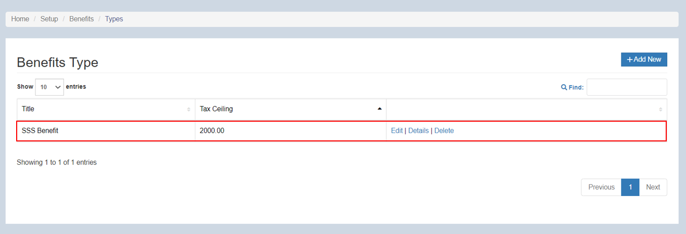

## Creating a Benefit Type

Here are the step-by-step instructions for creating a new **benefit type**:

### Step 1: Go to Benefits Page

&nbsp;&nbsp;&nbsp;&nbsp;&nbsp;&nbsp;&nbsp;&nbsp;&nbsp;&nbsp;&nbsp;**➥** In the sidebar menu, click on **`Setup`**.

&nbsp;&nbsp;&nbsp;&nbsp;&nbsp;&nbsp;&nbsp;&nbsp;&nbsp;&nbsp;&nbsp;**➥** Click on **`Benefits`**.

&nbsp;&nbsp;&nbsp;&nbsp;&nbsp;&nbsp;&nbsp;&nbsp;&nbsp;&nbsp;&nbsp;**➥** Select **`Types`**.

### Step 2: Adding New Benefit Type

&nbsp;&nbsp;&nbsp;&nbsp;&nbsp;&nbsp;&nbsp;&nbsp;&nbsp;&nbsp;&nbsp;**➥** You will be directed to the **Benefits Page**. Click the **`Add New`** button to create a new one.

&nbsp;&nbsp;&nbsp;&nbsp;&nbsp;&nbsp;&nbsp;&nbsp;&nbsp;&nbsp;&nbsp;**➥** Input the **Benefit title** and **Tax ceiling**.

:::info INFORMATION

Here are some common [**types of benefits**](../More/Benefit-Types.md) that employees may receive.

:::

### Step 3: Saving
&nbsp;&nbsp;&nbsp;&nbsp;&nbsp;&nbsp;&nbsp;&nbsp;&nbsp;&nbsp;&nbsp;**➥** Click the **`Create`** button to complete the process.

:::tip SUCCESS

**Congratulations!** You have successfully created a **Benefit type.**

#### NEXT STEP...

- You can now add a **Benefit Entitlement**.
- Click the **`Next`** button for the next instruction.

:::
