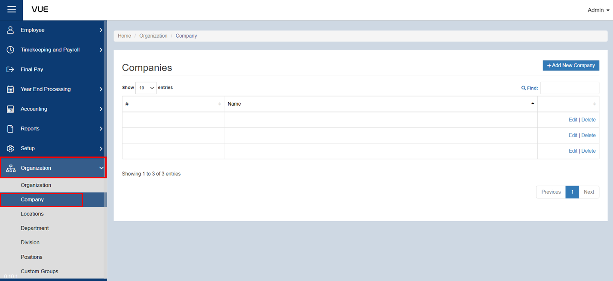
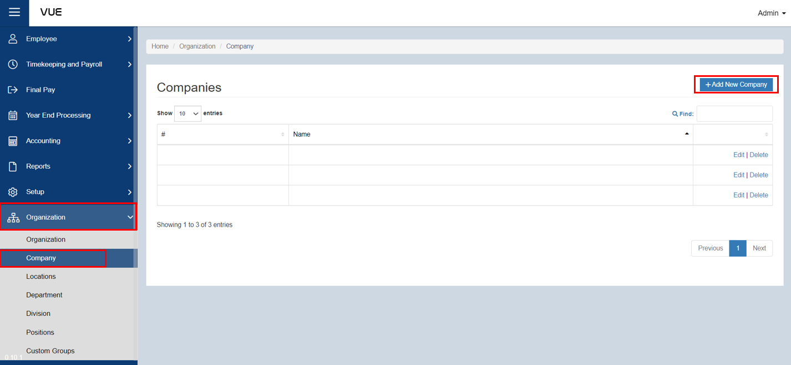
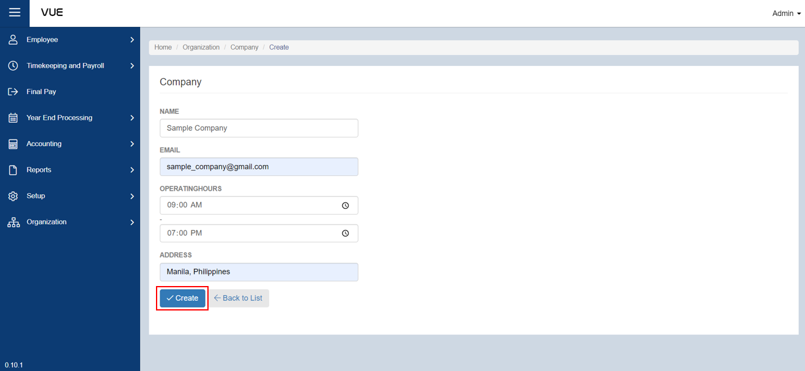

## Adding a New Company

Here are the step-by-step instructions for adding a **Company**:

### Step 1: Navigate to the Page

&nbsp;&nbsp;&nbsp;&nbsp;&nbsp;&nbsp;&nbsp;&nbsp;&nbsp;&nbsp;&nbsp;**➥** In the sidebar menu, click on **`Organization`**.

&nbsp;&nbsp;&nbsp;&nbsp;&nbsp;&nbsp;&nbsp;&nbsp;&nbsp;&nbsp;&nbsp;**➥** From the **`Organization`** dropdown menu, select **`Company`**.

### Step 2: Adding New Company

&nbsp;&nbsp;&nbsp;&nbsp;&nbsp;&nbsp;&nbsp;&nbsp;&nbsp;&nbsp;&nbsp;**➥** You will be directed to the **Companies Page**. Click the **`Add New Company`** button to create a new one.

&nbsp;&nbsp;&nbsp;&nbsp;&nbsp;&nbsp;&nbsp;&nbsp;&nbsp;&nbsp;&nbsp;**➥** Input the **Company name**, **Email**, set **Operating Hours**, and **Company address**.

&nbsp;&nbsp;&nbsp;&nbsp;&nbsp;&nbsp;&nbsp;&nbsp;&nbsp;&nbsp;&nbsp;**➥** Click the **`Create`** button to save the Company information.

:::tip SUCCESS

**Congratulations!** You have successfully added a **Company.**

#### NEXT STEP...

Next step is to create a **Department**. Click the **`Next`** button for the next instruction.

:::

