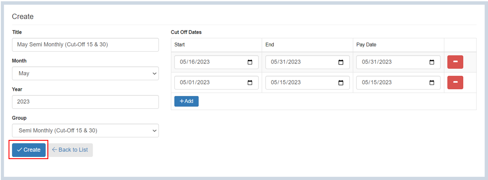

## Setting up the Cut Off Dates and Pay Periods

Here are the steps to set up **Period Groups** and **Cut off Dates**:

### Step 1: Navigate to the Page

&nbsp;&nbsp;&nbsp;&nbsp;&nbsp;&nbsp;&nbsp;&nbsp;&nbsp;&nbsp;&nbsp;**➥** In the sidebar menu, click on **`Setup`**.

&nbsp;&nbsp;&nbsp;&nbsp;&nbsp;&nbsp;&nbsp;&nbsp;&nbsp;&nbsp;&nbsp;**➥** Select **`Cut-off Dates and Pay Periods`**. 

You will be directed to the **Periods** page. On this page, you will find tabs for **Period Groups** and **Period Setup.** However, it is important to create **Period Groups** first.
 

### Step 2: Creating Period Groups

&nbsp;&nbsp;&nbsp;&nbsp;&nbsp;&nbsp;&nbsp;&nbsp;&nbsp;&nbsp;&nbsp;**➥** Click on the **`Add New`** button. 

&nbsp;&nbsp;&nbsp;&nbsp;&nbsp;&nbsp;&nbsp;&nbsp;&nbsp;&nbsp;&nbsp;**➥** Input the **Period Group** name.

&nbsp;&nbsp;&nbsp;&nbsp;&nbsp;&nbsp;&nbsp;&nbsp;&nbsp;&nbsp;&nbsp;**➥** Then, click **`Create`** button.

After creating the **Period Group**, proceed with setting up the **Cut-Off Dates**.

### Step 3: Setting up the Cut-off Dates

&nbsp;&nbsp;&nbsp;&nbsp;&nbsp;&nbsp;&nbsp;&nbsp;&nbsp;&nbsp;&nbsp;**➥** From the **Periods** page, click the **Period Setup** tab.

&nbsp;&nbsp;&nbsp;&nbsp;&nbsp;&nbsp;&nbsp;&nbsp;&nbsp;&nbsp;&nbsp;**➥** To set up the cut-off dates, click on the **`Add`** button.  

&nbsp;&nbsp;&nbsp;&nbsp;&nbsp;&nbsp;&nbsp;&nbsp;&nbsp;&nbsp;&nbsp;**➥** Select the **month.**
 
&nbsp;&nbsp;&nbsp;&nbsp;&nbsp;&nbsp;&nbsp;&nbsp;&nbsp;&nbsp;&nbsp;**➥** Input the **year.**

&nbsp;&nbsp;&nbsp;&nbsp;&nbsp;&nbsp;&nbsp;&nbsp;&nbsp;&nbsp;&nbsp;**➥** Select the **period group.**

:::info

**Example: Semi Monthly (Cut-off 15 & 30)**

This means that an employee will be paid twice a month, which is every 15th and 30th.

:::

&nbsp;&nbsp;&nbsp;&nbsp;&nbsp;&nbsp;&nbsp;&nbsp;&nbsp;&nbsp;&nbsp;**➥**
To set up cut-off dates, click on **`Add`** button.

&nbsp;&nbsp;&nbsp;&nbsp;&nbsp;&nbsp;&nbsp;&nbsp;&nbsp;&nbsp;&nbsp;**➥**
Select the **start date.** (mm/dd/yyy)

:::info

**Example: Start Date**

The **start date** of cut-off is the start of the period where the working days will be counted.

Suppose the start date is May 01, 2023. This means that May 01 - May 15 will be counted as working days for the first cut-off.

:::

&nbsp;&nbsp;&nbsp;&nbsp;&nbsp;&nbsp;&nbsp;&nbsp;&nbsp;&nbsp;&nbsp;**➥**
Select the **end date.** (mm/dd/yyy)

:::info

**Example: End Date**

The **end date** of cut-off is the end of the period where the working days were counted.

Suppose the end date is May 31, 2023. This means that May 16 - May 31 will be counted as working days for the first cut-off.

:::

&nbsp;&nbsp;&nbsp;&nbsp;&nbsp;&nbsp;&nbsp;&nbsp;&nbsp;&nbsp;&nbsp;**➥**
Select the **pay date.** (mm/dd/yyy)

:::info

**Example: Pay Date**

This date is when the employee will receive the salary for the first cut-off and last cut-off.

:::

&nbsp;&nbsp;&nbsp;&nbsp;&nbsp;&nbsp;&nbsp;&nbsp;&nbsp;&nbsp;&nbsp;**➥** Click the **`Create`** button to complete the process

:::tip SUCCESS

**Congratulations!** You have successfully set up a **Cut off Dates and Pay Periods.**

#### NEXT STEP...

- Next step is to continue adding the **Salary** to an Employee

- Click on **`Adding a Salary`** on the sidebar menu and proceed with the **Step 2**.

:::

