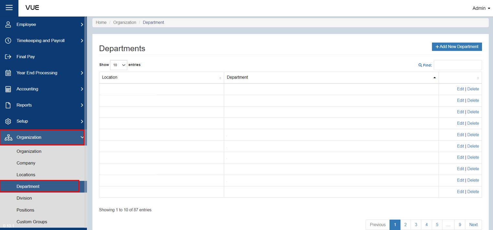
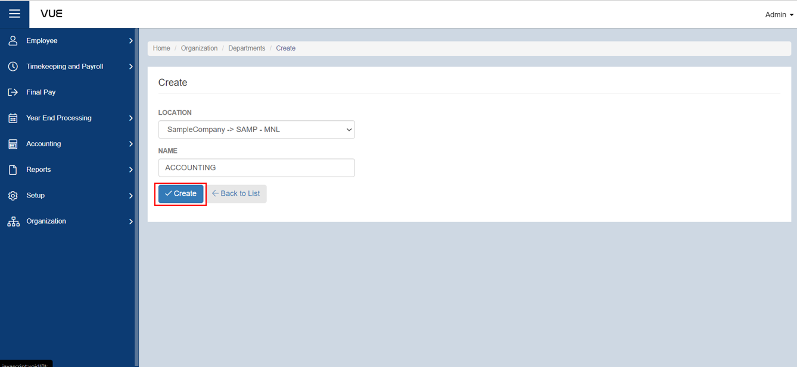

## Adding a New Department

Here are the step-by-step instructions for adding a **Department**:

### Step 1: Navigate to the Page

&nbsp;&nbsp;&nbsp;&nbsp;&nbsp;&nbsp;&nbsp;&nbsp;&nbsp;&nbsp;&nbsp;**➥** In the sidebar menu, click on **`Organization`**.

&nbsp;&nbsp;&nbsp;&nbsp;&nbsp;&nbsp;&nbsp;&nbsp;&nbsp;&nbsp;&nbsp;**➥** From the **`Organization`** dropdown menu, select **`Department`**.

### Step 2: Adding New Department

&nbsp;&nbsp;&nbsp;&nbsp;&nbsp;&nbsp;&nbsp;&nbsp;&nbsp;&nbsp;&nbsp;**➥** You will be directed to the **Department Page**. Click the **`Add New Department`** button to create a new one.

&nbsp;&nbsp;&nbsp;&nbsp;&nbsp;&nbsp;&nbsp;&nbsp;&nbsp;&nbsp;&nbsp;**➥** Select which **location** the department belongs to, then input the **name** of department.

&nbsp;&nbsp;&nbsp;&nbsp;&nbsp;&nbsp;&nbsp;&nbsp;&nbsp;&nbsp;&nbsp;**➥** Click the **`Create`** button to save the information.

:::tip SUCCESS

**Congratulations!** You have successfully added a **Department.**

#### NEXT STEP...

Next step is to create a **Group**. Click the **`Next`** button for the next instruction.

:::