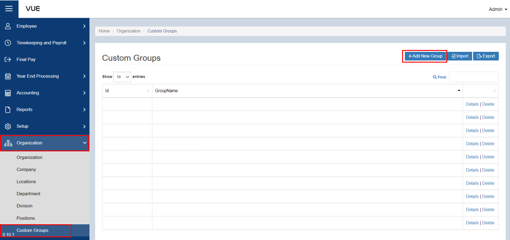
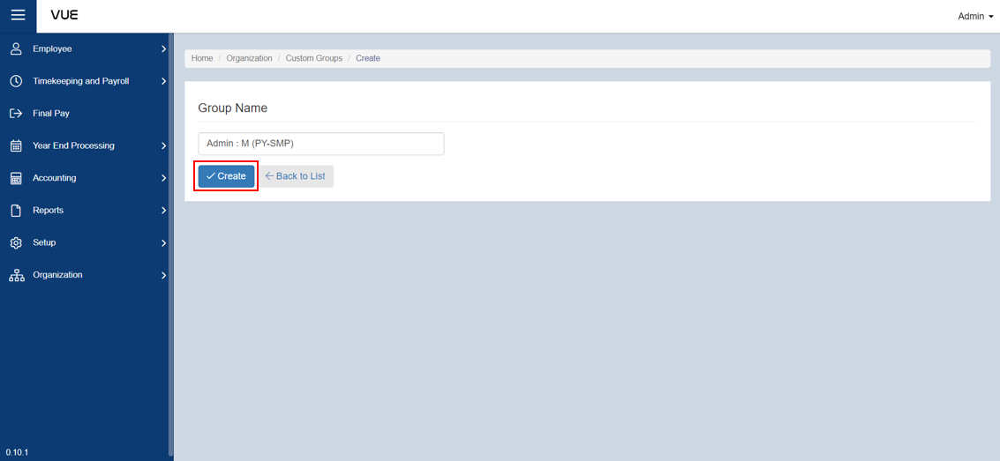

## Adding a New Group

Here are the step-by-step instructions for adding a **Group**:

### Step 1: Go to Group Page

&nbsp;&nbsp;&nbsp;&nbsp;&nbsp;&nbsp;&nbsp;&nbsp;&nbsp;&nbsp;&nbsp;**➥** In the sidebar menu, click on **`Organization`**.

&nbsp;&nbsp;&nbsp;&nbsp;&nbsp;&nbsp;&nbsp;&nbsp;&nbsp;&nbsp;&nbsp;**➥** From the **`Organization`** dropdown menu, select **`Custom Groups`**.

### Step 2: Adding New Group

&nbsp;&nbsp;&nbsp;&nbsp;&nbsp;&nbsp;&nbsp;&nbsp;&nbsp;&nbsp;&nbsp;**➥** You will be directed to the **Group Page**. Click the **`Add New Group`** button to create a new one.

&nbsp;&nbsp;&nbsp;&nbsp;&nbsp;&nbsp;&nbsp;&nbsp;&nbsp;&nbsp;&nbsp;**➥** Input the **name** of Group.

&nbsp;&nbsp;&nbsp;&nbsp;&nbsp;&nbsp;&nbsp;&nbsp;&nbsp;&nbsp;&nbsp;**➥** Click the **`Create`** button to save the information.

:::tip SUCCESS

**Congratulations!** You have successfully added a **Group**

#### NEXT STEP...

Next step is to create a **Location**. Click the **`Next`** button for the next instruction.

:::