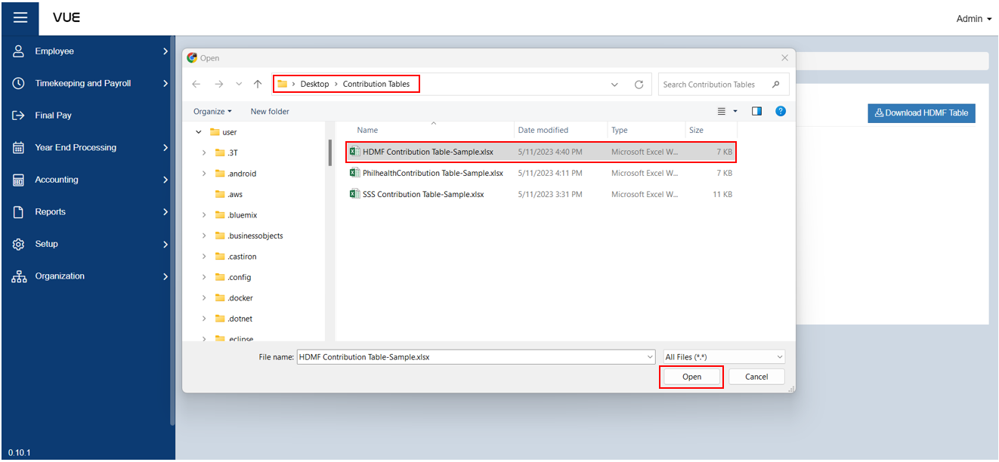

## Add a Home Development Mutual Fund (HDMF) Contribution Table

  
Definition of Terms for HDMF Contribution Table

  
The Home Development Mutual Fund (HDMF) Contribution Table is a guide for determining the monthly contribution of an employee and employer to the Pag-IBIG Fund, a government agency in the Philippines that provides affordable housing financing and savings programs for Filipino workers.
  

  
  
   
    
Minimum

    
This is the minimum monthly compensation or salary that is subject to Pag-IBIG Fund contributions. For example, if the minimum monthly salary is PHP 5,000, then any employee who earns PHP 5,000 or more per month is required to contribute to Pag-IBIG Fund.

    
Maximum

    
This is the maximum monthly compensation or salary that is subject to Pag-IBIG Fund contributions. Any amount that exceeds the maximum limit is no longer included in the computation of Pag-IBIG contributions. For example, if the maximum monthly salary is PHP 50,000, any employee who earns PHP 50,000 or more per month will only be required to contribute the maximum Pag-IBIG contribution.

    
EE Multiplier

    
This refers to the contribution rate of the employer or company to the Pag-IBIG Fund. It is based on a percentage of the employee's monthly compensation or salary. The employer's contribution rate is currently set at 2% of the employee's monthly compensation.

    
ER Multiplier

    
This refers to the contribution rate of the employee to the Pag-IBIG Fund. It is also based on a percentage of the employee's monthly compensation or salary. The employee's contribution rate is currently set at 2% of their monthly compensation.

Here are the steps to add **HDMF Contribution Table**:

### Step 1: Navigate to the Page

&nbsp;&nbsp;&nbsp;&nbsp;&nbsp;&nbsp;&nbsp;&nbsp;&nbsp;&nbsp;&nbsp;**➥** Click on the **`Setup`** dropdown button.

&nbsp;&nbsp;&nbsp;&nbsp;&nbsp;&nbsp;&nbsp;&nbsp;&nbsp;&nbsp;&nbsp;**➥** Select **`Government Benefits and Factors`**.

&nbsp;&nbsp;&nbsp;&nbsp;&nbsp;&nbsp;&nbsp;&nbsp;&nbsp;&nbsp;&nbsp;**➥** Click on **`HDMF Table`**.

### Step 2: Create New SSS Contribution Table

&nbsp;&nbsp;&nbsp;&nbsp;&nbsp;&nbsp;&nbsp;&nbsp;&nbsp;&nbsp;&nbsp;**➥** Click on the **`Add New`** button.

&nbsp;&nbsp;&nbsp;&nbsp;&nbsp;&nbsp;&nbsp;&nbsp;&nbsp;&nbsp;&nbsp;**➥** Input a description and year for the HDMF contribution table.

### Step 4: Upload the file for SSS Contribution Table 

&nbsp;&nbsp;&nbsp;&nbsp;&nbsp;&nbsp;&nbsp;&nbsp;&nbsp;&nbsp;&nbsp;**➥** Click the **`Choose File`** button.

&nbsp;&nbsp;&nbsp;&nbsp;&nbsp;&nbsp;&nbsp;&nbsp;&nbsp;&nbsp;&nbsp;**➥** Find the location of the file to be uploaded.

&nbsp;&nbsp;&nbsp;&nbsp;&nbsp;&nbsp;&nbsp;&nbsp;&nbsp;&nbsp;&nbsp;**➥** Click **`Open`** to upload the file.

### Step 4: Saving
&nbsp;&nbsp;&nbsp;&nbsp;&nbsp;&nbsp;&nbsp;&nbsp;&nbsp;&nbsp;&nbsp;**➥** Click the **`Create`** button to complete the process.

### Step 5: Edit, View, and Download the uploaded Table

&nbsp;&nbsp;&nbsp;&nbsp;&nbsp;&nbsp;&nbsp;&nbsp;&nbsp;&nbsp;&nbsp;**➥** Click the **`Edit`** button to edit the HDMF Contribution Table.

&nbsp;&nbsp;&nbsp;&nbsp;&nbsp;&nbsp;&nbsp;&nbsp;&nbsp;&nbsp;&nbsp;**➥** Then, click the **`Save`** button to save the changes.

&nbsp;&nbsp;&nbsp;&nbsp;&nbsp;&nbsp;&nbsp;&nbsp;&nbsp;&nbsp;&nbsp;**➥** Click the **`Details`** button to view the details of HDMF Contribution Table.

&nbsp;&nbsp;&nbsp;&nbsp;&nbsp;&nbsp;&nbsp;&nbsp;&nbsp;&nbsp;&nbsp;**➥** Click the **`Download HDMF Table`** button to download the Philhealth Contribution Table.

:::tip SUCCESS

**Congratulations!** You have successfully added a **HDMF Table**

#### NEXT STEP...

- You can now add a **Tax Contribution Table**.
- Click the **`Next`** button for the next instruction.

:::

