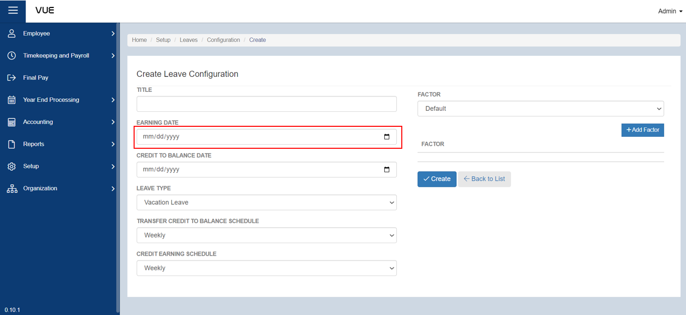

## Setting up Leave Configuration

Here are the step-by-step instructions for setting up **leave configuration**:

### Step 1: Go to Leave - Entitlement Page

&nbsp;&nbsp;&nbsp;&nbsp;&nbsp;&nbsp;&nbsp;&nbsp;&nbsp;&nbsp;&nbsp;**➥** In the sidebar menu, click on **`Setup`**.

&nbsp;&nbsp;&nbsp;&nbsp;&nbsp;&nbsp;&nbsp;&nbsp;&nbsp;&nbsp;&nbsp;**➥** Click on **`Leaves`**.

&nbsp;&nbsp;&nbsp;&nbsp;&nbsp;&nbsp;&nbsp;&nbsp;&nbsp;&nbsp;&nbsp;**➥** Select **`Configuration`**.

### Step 2: Creating New Leave Cofiguration

&nbsp;&nbsp;&nbsp;&nbsp;&nbsp;&nbsp;&nbsp;&nbsp;&nbsp;&nbsp;&nbsp;**➥** You will be directed to the **Leave Configuration Page**. Click the **`Add New Configuration`** button to create a new one.

&nbsp;&nbsp;&nbsp;&nbsp;&nbsp;&nbsp;&nbsp;&nbsp;&nbsp;&nbsp;&nbsp;**➥** In the Create Leave Configuration Page, input the necessary details such as:

  
Title

  
The title serves as an identifier for the leave configuration, allowing you to easily distinguish it from other configurations you have created. 
  

     

  
Earning Date

  
The earning date in leave configuration refers to the date when an employee becomes eligible to earn a specific type of leave. It is an essential component in configuring leave entitlements, as it helps to determine when an employee can start accumulating leave credits. The purpose of setting an earning date is to ensure that an employee's leave entitlements are accurately calculated based on their length of service and other relevant factors.
  

     

  
Credit to Balance Date

  
In setting up a leave configuration, the "Credit to Balance Date" is a crucial factor to determine the period in which an employee's leave balance will be credited. This date signifies when an employee's entitlement will be credited into their leave balance. The purpose of having this date is to ensure that the employees' leave balances are up-to-date, accurate and to avoid any confusion and discrepancies.
  

     

  
Leave Type

  
The "Leave Type" in a leave configuration refers to the specific category of leave being granted to an employee. This is where the employer can define the different types of leave available such as sick leave, vacation leave, maternity/paternity leave, etc. The purpose of defining the leave type is to ensure that employees are properly granted the correct type of leave they are entitled to, and that the leave balances and records are accurately tracked and managed.
  

     

  
Transfer Credit to Balance

  
Transfer Credit to Balance defines how and when a leave balance is transferred to an employee's credit balance. The credit balance can be used to offset future leave requests, and the transfer schedule helps ensure that employees have enough leave credits available when needed. By specifying the transfer schedule, companies can control when leave credits are earned and when they become available for use.
  

     

  
Credit Earning Schedule

  
In leave configuration, the credit earning schedule refers to the specific schedule or time frame when an employee earns leave credits based on their employment duration or other criteria. This schedule determines how much leave an employee will accrue and when it will be credited to their balance. The purpose of credit earning schedule is to ensure that employees receive the appropriate amount of leave credits and that it is credited to their balance at the correct time.
  

     

&nbsp;&nbsp;&nbsp;&nbsp;&nbsp;&nbsp;&nbsp;&nbsp;&nbsp;&nbsp;&nbsp;**➥** Select what type of **`Factor`** then click the **`Add Factor`** button to add.

  
Factor

  
One of the important steps is selecting the factors that will be used to determine an employee's entitlement to leave. Factors can include things like attendance or performance. Selecting the factor of attendance means that an employee's attendance record will be used to determine their leave entitlement. The purpose of selecting a factor like attendance is to ensure that leave entitlement is based on objective and measurable criteria, rather than being arbitrary or subject to favoritism.
  

     

#### Step 3: Saving

&nbsp;&nbsp;&nbsp;&nbsp;&nbsp;&nbsp;&nbsp;&nbsp;&nbsp;&nbsp;&nbsp;**➥** Click the **`Create`** button to complete the process.

:::tip SUCCESS

**Congratulations!** You have successfully added a **Leave Configuration**

#### NEXT STEP...

- You can now add a **Leave Entitlement**.
- Click the **`Next`** button for the next instruction.

:::