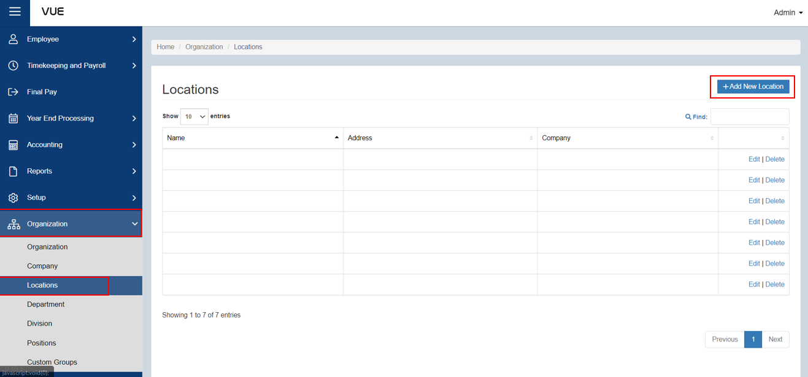
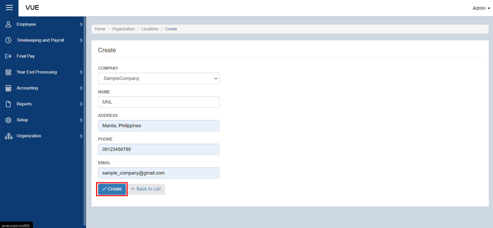

## Adding a New Location

Here are the step-by-step instructions for adding a **Location**:

### Step 1: Go to Locations Page

&nbsp;&nbsp;&nbsp;&nbsp;&nbsp;&nbsp;&nbsp;&nbsp;&nbsp;&nbsp;&nbsp;**➥** In the sidebar menu, click on **`Organization`**.

&nbsp;&nbsp;&nbsp;&nbsp;&nbsp;&nbsp;&nbsp;&nbsp;&nbsp;&nbsp;&nbsp;**➥** From the **`Organization`** dropdown menu, select **`Locations`**.

### Step 2: Adding New Locations

&nbsp;&nbsp;&nbsp;&nbsp;&nbsp;&nbsp;&nbsp;&nbsp;&nbsp;&nbsp;&nbsp;**➥** You will be directed to the **Locations Page**. Click the **`Add New Location`** button to create a new one.

&nbsp;&nbsp;&nbsp;&nbsp;&nbsp;&nbsp;&nbsp;&nbsp;&nbsp;&nbsp;&nbsp;**➥** Select which **company** the location belongs to, then input the **name, address, phone number, and email**.

&nbsp;&nbsp;&nbsp;&nbsp;&nbsp;&nbsp;&nbsp;&nbsp;&nbsp;&nbsp;&nbsp;**➥** Click the **`Create`** button to save the informations.

:::tip SUCCESS

**Congratulations!** You have successfully added a **Location**

#### NEXT STEP...

Next step is to create a **Position**. Click the **`Next`** button for the next instruction.

:::