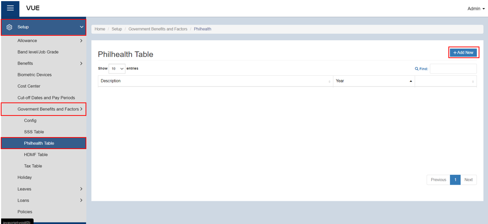
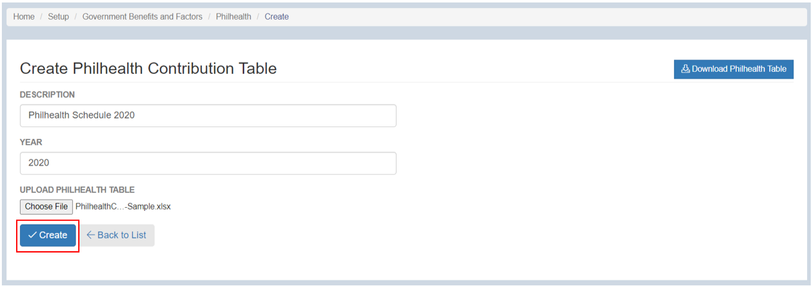

## Add a Philhealth Contribution Table

  
Definition of Terms for Philhealth Contribution Table

  
The PhilHealth Contribution Table shows the contribution amount based on an individual's monthly compensation. The employee's share is a fixed amount based on the Premium Rate, while the employer's share varies depending on the monthly compensation of the employee. The table also shows the total monthly premium that needs to be paid, which is the sum of the employee and employer shares.
  

  
   
    
Minimum

    
This is the lowest monthly salary or income level on which the PhilHealth premium is based. The minimum monthly salary or income level is set by the government.

    
Maximum

    
This is the highest monthly salary or income level on which the PhilHealth premium is based. The maximum monthly salary or income level is set by the government.

    
ER

    
This stands for "employer's share." This is the portion of the PhilHealth contribution that the employer pays on behalf of their employees.

    
EE

    
This stands for "employee's share." This is the portion of the PhilHealth contribution that the employee pays.

    
Multiplier

    
This is a factor used to determine the PhilHealth contribution for employees who earn more than the maximum monthly salary or income level. The multiplier is used to compute the PhilHealth contribution based on a percentage of the employee's monthly salary or income.

Here are the steps to add **Philhealth Contribution Table**:

### Step 1: Navigate to the Page

&nbsp;&nbsp;&nbsp;&nbsp;&nbsp;&nbsp;&nbsp;&nbsp;&nbsp;&nbsp;&nbsp;**➥** Click on the **`Setup`** dropdown button.

&nbsp;&nbsp;&nbsp;&nbsp;&nbsp;&nbsp;&nbsp;&nbsp;&nbsp;&nbsp;&nbsp;**➥** Select **`Government Benefits and Factors`**.

&nbsp;&nbsp;&nbsp;&nbsp;&nbsp;&nbsp;&nbsp;&nbsp;&nbsp;&nbsp;&nbsp;**➥** Click on **`Philhealth Table`**.

### Step 2: Create New SSS Contribution Table

&nbsp;&nbsp;&nbsp;&nbsp;&nbsp;&nbsp;&nbsp;&nbsp;&nbsp;&nbsp;&nbsp;**➥** Click on the **`Add New`** button.

&nbsp;&nbsp;&nbsp;&nbsp;&nbsp;&nbsp;&nbsp;&nbsp;&nbsp;&nbsp;&nbsp;**➥** Input a description and year for the Philhealth contribution table.

### Step 4: Upload the file for SSS Contribution Table 

&nbsp;&nbsp;&nbsp;&nbsp;&nbsp;&nbsp;&nbsp;&nbsp;&nbsp;&nbsp;&nbsp;**➥** Click the **`Choose File`** button.

&nbsp;&nbsp;&nbsp;&nbsp;&nbsp;&nbsp;&nbsp;&nbsp;&nbsp;&nbsp;&nbsp;**➥** Find the location of the file to be uploaded.

&nbsp;&nbsp;&nbsp;&nbsp;&nbsp;&nbsp;&nbsp;&nbsp;&nbsp;&nbsp;&nbsp;**➥** Click **`Open`** to upload the file.

### Step 4: Saving
&nbsp;&nbsp;&nbsp;&nbsp;&nbsp;&nbsp;&nbsp;&nbsp;&nbsp;&nbsp;&nbsp;**➥** Click the **`Create`** button to complete the process.

### Step 5: Edit, View, and Download the uploaded Table

&nbsp;&nbsp;&nbsp;&nbsp;&nbsp;&nbsp;&nbsp;&nbsp;&nbsp;&nbsp;&nbsp;**➥** Click the **`Edit`** button to edit the Philhealth Contribution Table.

&nbsp;&nbsp;&nbsp;&nbsp;&nbsp;&nbsp;&nbsp;&nbsp;&nbsp;&nbsp;&nbsp;**➥** Then, click the **`Save`** button to save the changes.

&nbsp;&nbsp;&nbsp;&nbsp;&nbsp;&nbsp;&nbsp;&nbsp;&nbsp;&nbsp;&nbsp;**➥** Click the **`Details`** button to view the details of Philhealth Contribution Table.

&nbsp;&nbsp;&nbsp;&nbsp;&nbsp;&nbsp;&nbsp;&nbsp;&nbsp;&nbsp;&nbsp;**➥** Click the **`Download Philhealth Table`** button to download the Philhealth Contribution Table.

:::tip SUCCESS

**Congratulations!** You have successfully added a **Philhealth Contibution Table**

#### NEXT STEP...

- You can now add a **HDMF Contribution Table**.
- Click the **`Next`** button for the next instruction.

:::

