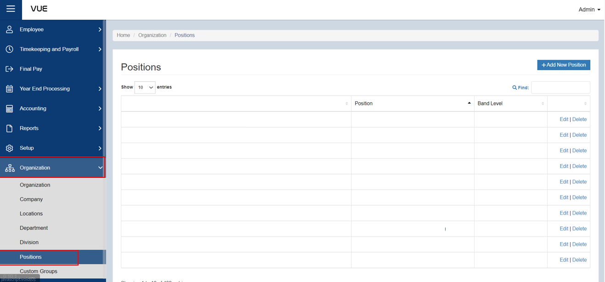
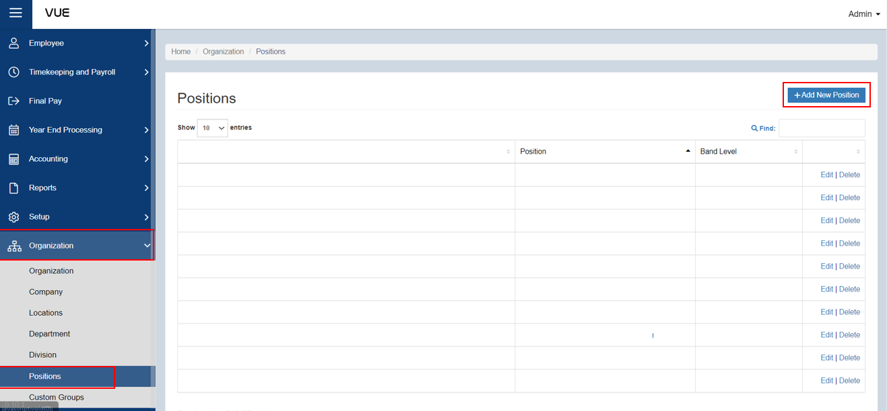
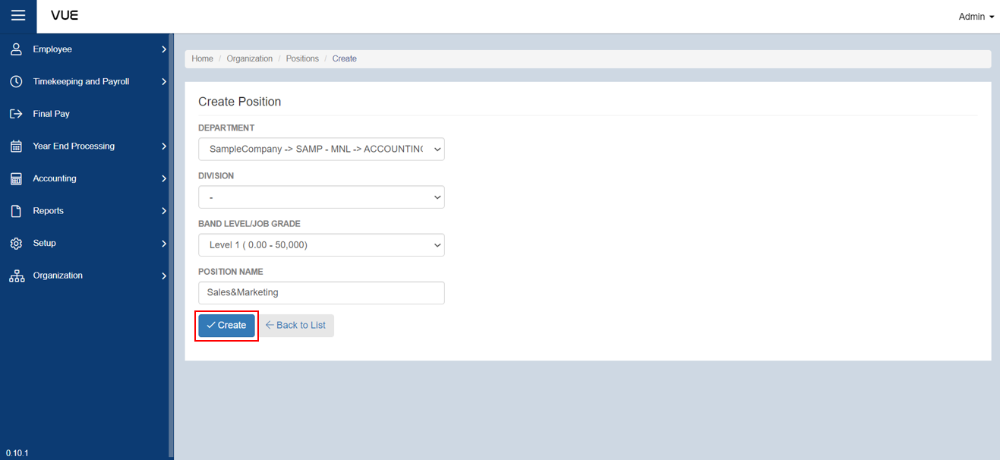

## Adding a New Position

Here are the step-by-step instructions for adding a Location:

### Step 1: Go to Positions Page

&nbsp;&nbsp;&nbsp;&nbsp;&nbsp;&nbsp;&nbsp;&nbsp;&nbsp;&nbsp;&nbsp;**➥** In the sidebar menu, click on **`Organization`**.

&nbsp;&nbsp;&nbsp;&nbsp;&nbsp;&nbsp;&nbsp;&nbsp;&nbsp;&nbsp;&nbsp;**➥** From the **`Organization`** dropdown menu, select **`Positions`**.

### Step 2: Adding New Positions

&nbsp;&nbsp;&nbsp;&nbsp;&nbsp;&nbsp;&nbsp;&nbsp;&nbsp;&nbsp;&nbsp;**➥** You will be directed to the Positions Page. Click the **`Add New Position`** button to create a new one.

&nbsp;&nbsp;&nbsp;&nbsp;&nbsp;&nbsp;&nbsp;&nbsp;&nbsp;&nbsp;&nbsp;**➥** Select which department, division, band level/job grade the position belongs to, then input the name of position.

&nbsp;&nbsp;&nbsp;&nbsp;&nbsp;&nbsp;&nbsp;&nbsp;&nbsp;&nbsp;&nbsp;**➥** Click the **`Create`** button to save the informations.

:::tip SUCCESS

**Congratulations!** You have successfully created a **Position.**

#### NEXT STEP...

- Next step is to continue creating the **Employee Profile**.

- Click on **`Create Employee Profile`** on the sidebar menu and proceed with the **Step 2**.

:::

