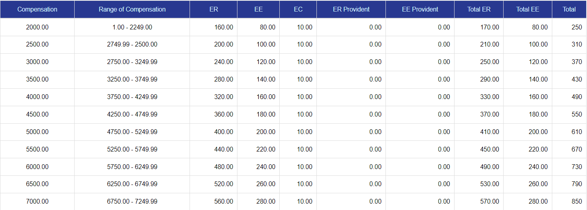
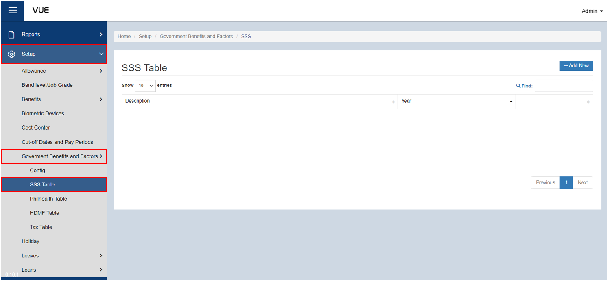
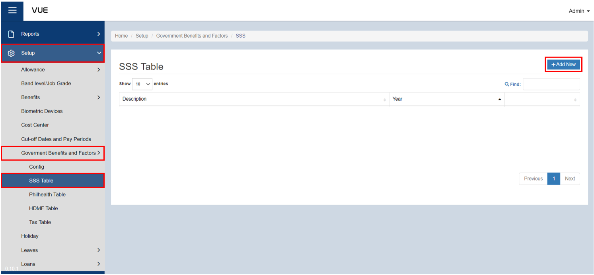
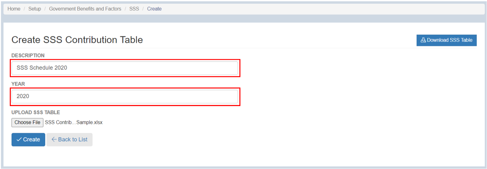
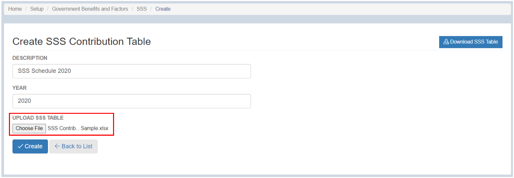
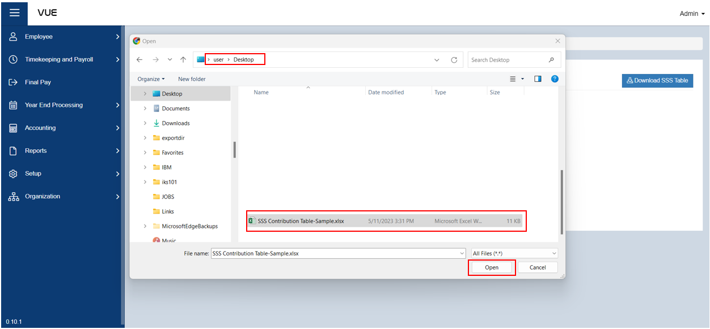
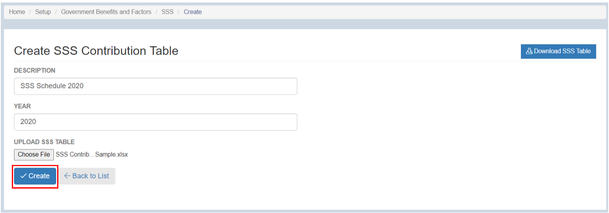
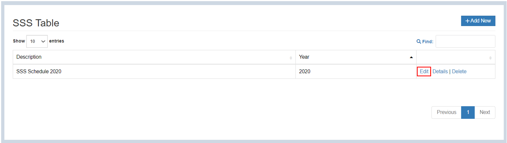
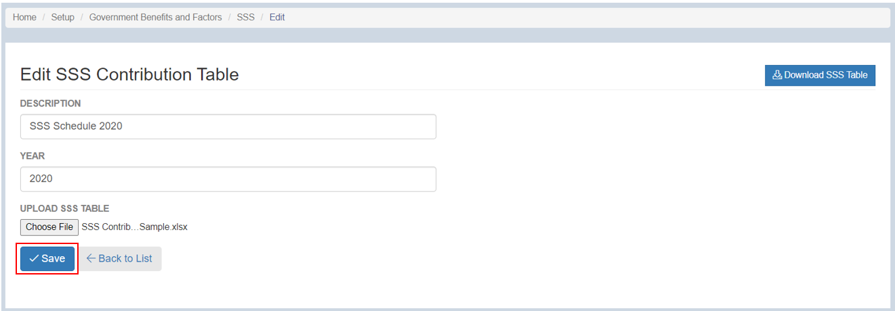
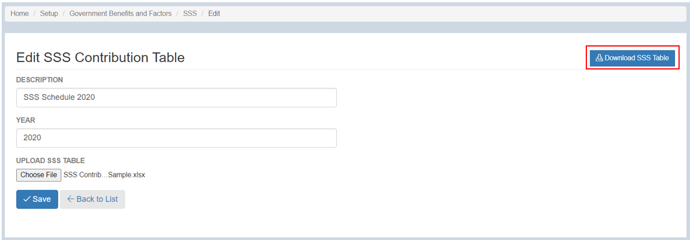

## Add an SSS Contribution Table

  
Definition of Terms for SSS Contribution Table

  
The Social Security System (SSS) Contribution Table is a guide used to determine the amount of contribution that an employee and their employer must pay to the SSS. It lists down the salary range and the corresponding contribution rates for both the employee and employer. The table also shows the total monthly contribution amount that should be remitted to the SSS. The contribution is deducted from the employee's salary and an equivalent amount is paid by the employer to the SSS.
  

  
  
   
    
Compensation

    
This refers to the employee's monthly salary or wage, which is used as the basis for computing their SSS contributions.

    
Minimum

    
This is the minimum monthly salary or wage that is subject to SSS contributions.

    
Maximum

    
This is the maximum monthly salary or wage that is subject to SSS contributions.

    
ER

    
This stands for "employer's share" and refers to the amount of the SSS contribution that the employer is responsible for paying.

    
EE

    
This stands for "employee's share" and refers to the amount of the SSS contribution that the employee is responsible for paying.

    
EC

    
This stands for "employer's compensation" and refers to the amount of the SSS contribution that the employer is responsible for paying in addition to the employee's contribution. This is used to fund SSS benefits for work-related injuries or illnesses.

    
ER Provident

    
This is the portion of the employer's contribution that goes towards the employee's Provident Fund account.

    
EE Provident

    
This is the portion of the employee's contribution that goes towards their Provident Fund account.

    
Total ER

    
This is the total amount of the SSS contribution that the employer is responsible for paying, including their share and the EC.

    
Total EE

    
This is the total amount of the SSS contribution that the employee is responsible for paying, including their share and the EE Provident Fund contribution.

    
Total:

    
This is the total amount of the SSS contribution, including both the employer and employee shares and the EC and EE Provident Fund contributions.

Here are the steps to add **SSS Contribution Table**:

### Step 1: Navigate to the Page

&nbsp;&nbsp;&nbsp;&nbsp;&nbsp;&nbsp;&nbsp;&nbsp;&nbsp;&nbsp;&nbsp;**➥** Click on the **`Setup`** dropdown button.

&nbsp;&nbsp;&nbsp;&nbsp;&nbsp;&nbsp;&nbsp;&nbsp;&nbsp;&nbsp;&nbsp;**➥** Select **`Government Benefits and Factors`**.

&nbsp;&nbsp;&nbsp;&nbsp;&nbsp;&nbsp;&nbsp;&nbsp;&nbsp;&nbsp;&nbsp;**➥** Click on **`SSS Table`**.

### Step 2: Create New SSS Contribution Table

&nbsp;&nbsp;&nbsp;&nbsp;&nbsp;&nbsp;&nbsp;&nbsp;&nbsp;&nbsp;&nbsp;**➥** Click on the **`Add New`** button.

&nbsp;&nbsp;&nbsp;&nbsp;&nbsp;&nbsp;&nbsp;&nbsp;&nbsp;&nbsp;&nbsp;**➥** Input a description and year for the SSS contribution table.

### Step 4: Upload the file for SSS Contribution Table 

&nbsp;&nbsp;&nbsp;&nbsp;&nbsp;&nbsp;&nbsp;&nbsp;&nbsp;&nbsp;&nbsp;**➥** Click the **`Choose File`** button.

&nbsp;&nbsp;&nbsp;&nbsp;&nbsp;&nbsp;&nbsp;&nbsp;&nbsp;&nbsp;&nbsp;**➥** Find the location of the file to be uploaded.

&nbsp;&nbsp;&nbsp;&nbsp;&nbsp;&nbsp;&nbsp;&nbsp;&nbsp;&nbsp;&nbsp;**➥** Click **`Open`** to upload the file.

### Step 4: Saving
&nbsp;&nbsp;&nbsp;&nbsp;&nbsp;&nbsp;&nbsp;&nbsp;&nbsp;&nbsp;&nbsp;**➥** Click the **`Create`** button to complete the process.

### Step 5: Edit, View, and Download the uploaded Table

&nbsp;&nbsp;&nbsp;&nbsp;&nbsp;&nbsp;&nbsp;&nbsp;&nbsp;&nbsp;&nbsp;**➥** Click the **`Edit`** button to edit the SSS Contribution Table.

&nbsp;&nbsp;&nbsp;&nbsp;&nbsp;&nbsp;&nbsp;&nbsp;&nbsp;&nbsp;&nbsp;**➥** Then, click the **`Save`** button to save the changes.

&nbsp;&nbsp;&nbsp;&nbsp;&nbsp;&nbsp;&nbsp;&nbsp;&nbsp;&nbsp;&nbsp;**➥** Click the **`Details`** button to view the details of SSS Contribution Table.

&nbsp;&nbsp;&nbsp;&nbsp;&nbsp;&nbsp;&nbsp;&nbsp;&nbsp;&nbsp;&nbsp;**➥** Click the **`Download SSS Table`** button to download the SSS Contribution Table.

:::tip SUCCESS

**Congratulations!** You have successfully added an **SSS Contibution Table**

#### NEXT STEP...

- You can now add a **Philhealth Contribution Table**.
- Click the **`Next`** button for the next instruction.

:::

