## Add a Tax Contribution Table

Here are the steps to add **Tax Contribution Table**:

  
Definition of Terms for Tax Contribution Table

  
The Tax Withholding Contribution Table is used by employers to calculate the amount of tax to be withheld from an employee's salary or wages each pay period. The amount of tax withheld is then remitted to the BIR on behalf of the employee.
  

  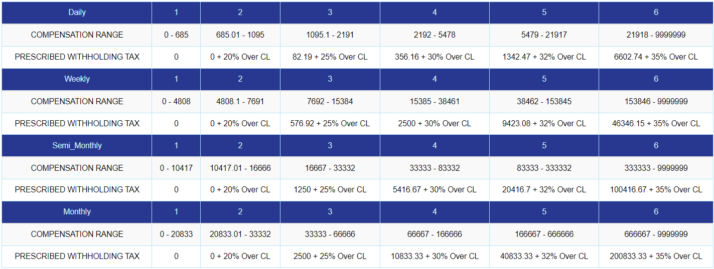
   
    
Compensation Range

    
The compensation range refers to the amount of income an employee earns, which is typically divided into different brackets or ranges.

    
Prescribed Withholding Tax

    
The prescribed withholding tax, on the other hand, refers to the percentage of income tax that should be withheld based on the employee's compensation range.

### Step 1: Navigate to the Page

&nbsp;&nbsp;&nbsp;&nbsp;&nbsp;&nbsp;&nbsp;&nbsp;&nbsp;&nbsp;&nbsp;**➥** Click on the **`Setup`** dropdown button.

&nbsp;&nbsp;&nbsp;&nbsp;&nbsp;&nbsp;&nbsp;&nbsp;&nbsp;&nbsp;&nbsp;**➥** Select **`Government Benefits and Factors`**.

&nbsp;&nbsp;&nbsp;&nbsp;&nbsp;&nbsp;&nbsp;&nbsp;&nbsp;&nbsp;&nbsp;**➥** Click on **`Tax Table`**.

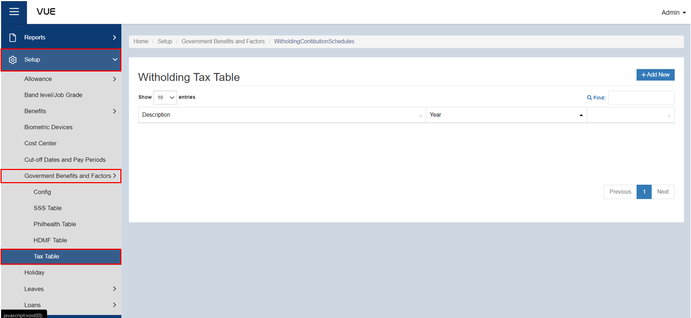

### Step 2: Create New SSS Contribution Table

&nbsp;&nbsp;&nbsp;&nbsp;&nbsp;&nbsp;&nbsp;&nbsp;&nbsp;&nbsp;&nbsp;**➥** Click on the **`Add New`** button.

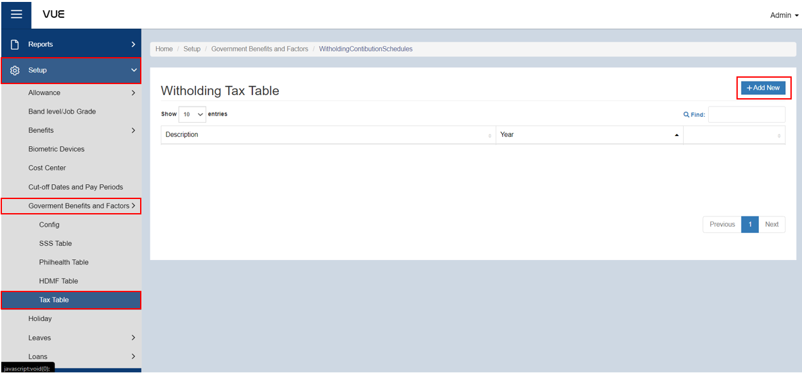

&nbsp;&nbsp;&nbsp;&nbsp;&nbsp;&nbsp;&nbsp;&nbsp;&nbsp;&nbsp;&nbsp;**➥** Input a description and year for the Tax contribution table.

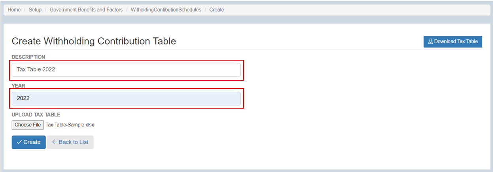

### Step 4: Upload the file for SSS Contribution Table 

&nbsp;&nbsp;&nbsp;&nbsp;&nbsp;&nbsp;&nbsp;&nbsp;&nbsp;&nbsp;&nbsp;**➥** Click the **`Choose File`** button.

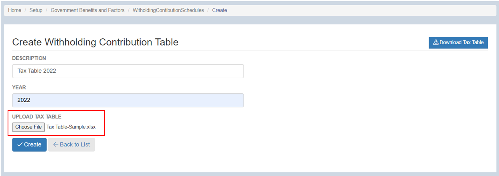

&nbsp;&nbsp;&nbsp;&nbsp;&nbsp;&nbsp;&nbsp;&nbsp;&nbsp;&nbsp;&nbsp;**➥** Find the location of the file to be uploaded.

&nbsp;&nbsp;&nbsp;&nbsp;&nbsp;&nbsp;&nbsp;&nbsp;&nbsp;&nbsp;&nbsp;**➥** Click **`Open`** to upload the file.

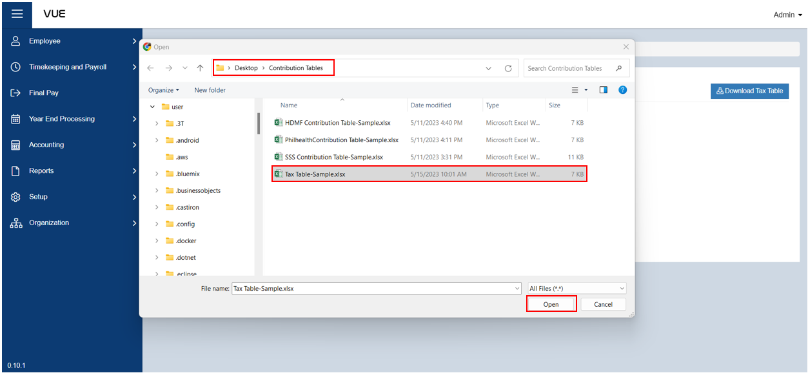

### Step 4: Saving
&nbsp;&nbsp;&nbsp;&nbsp;&nbsp;&nbsp;&nbsp;&nbsp;&nbsp;&nbsp;&nbsp;**➥** Click the **`Create`** button to complete the process.

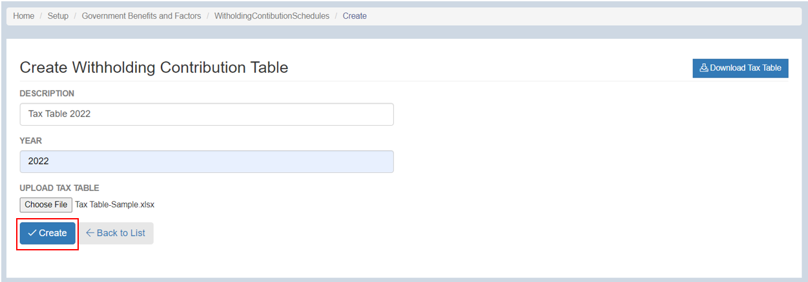

### Step 5: Edit, View, and Download the uploaded Table

&nbsp;&nbsp;&nbsp;&nbsp;&nbsp;&nbsp;&nbsp;&nbsp;&nbsp;&nbsp;&nbsp;**➥** Click the **`Edit`** button to edit the Tax Contribution Table.

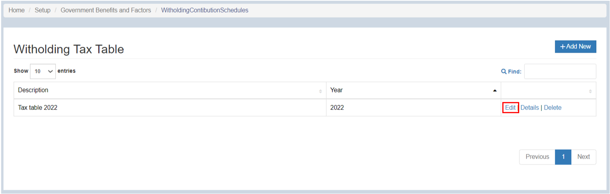

&nbsp;&nbsp;&nbsp;&nbsp;&nbsp;&nbsp;&nbsp;&nbsp;&nbsp;&nbsp;&nbsp;**➥** Then, click the **`Save`** button to save the changes.

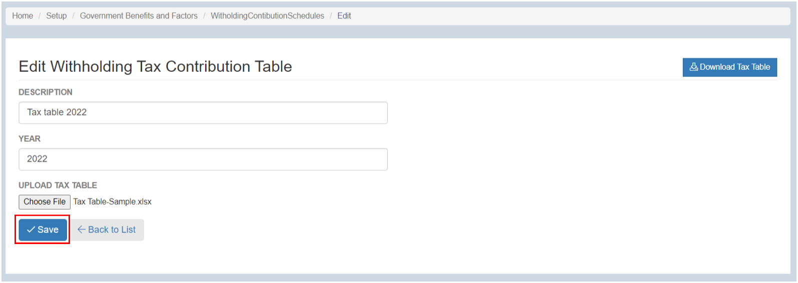

&nbsp;&nbsp;&nbsp;&nbsp;&nbsp;&nbsp;&nbsp;&nbsp;&nbsp;&nbsp;&nbsp;**➥** Click the **`Details`** button to view the details of Tax Contribution Table.

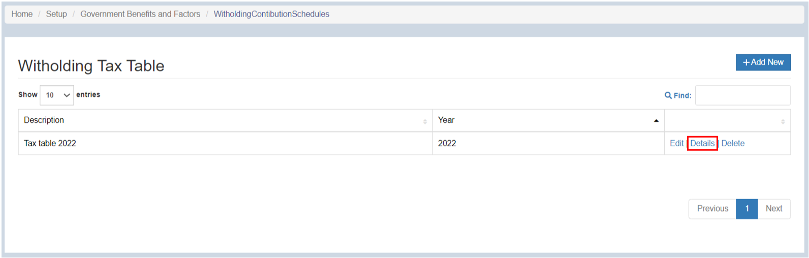

&nbsp;&nbsp;&nbsp;&nbsp;&nbsp;&nbsp;&nbsp;&nbsp;&nbsp;&nbsp;&nbsp;**➥** Click the **`Download HDMF Table`** button to download the Philhealth Contribution Table.

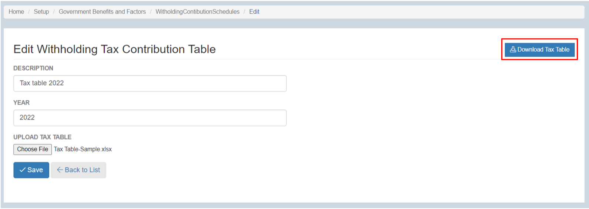

:::tip SUCCESS

**Congratulations!** You have successfully added a **Tax Table**

#### NEXT STEP...

- Next step is to continue with the **Setup Benefits and Factors**

- Click on **`Setup Benefits and Factors`** on the sidebar menu and proceed with the **Step 2**.

:::

