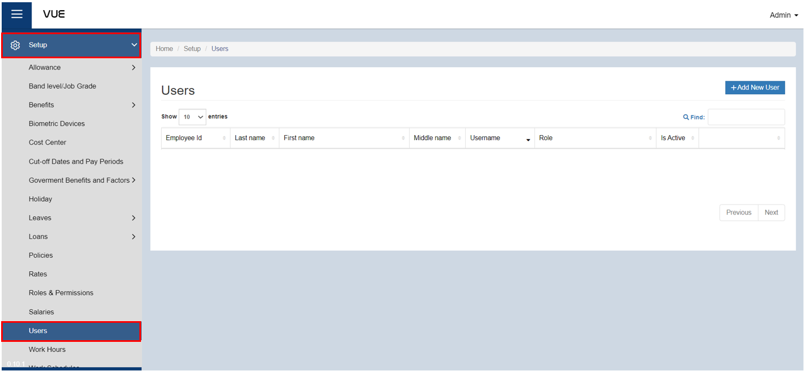
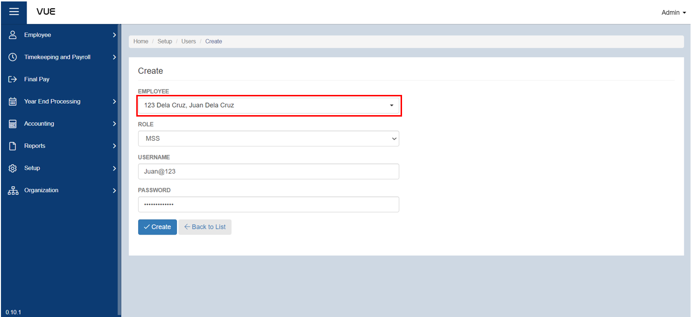
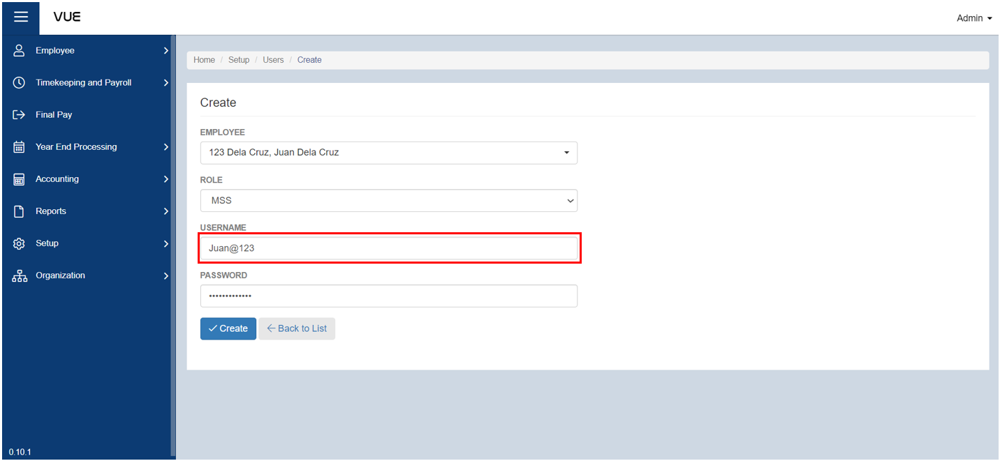
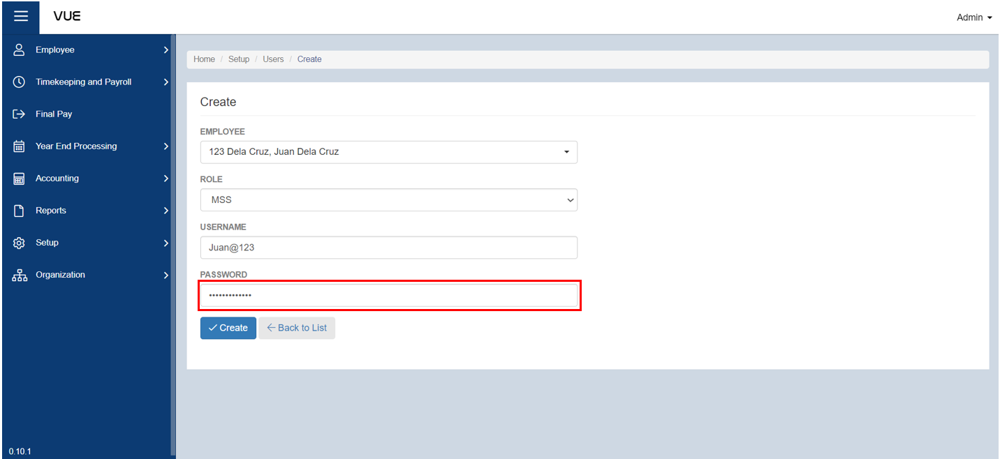
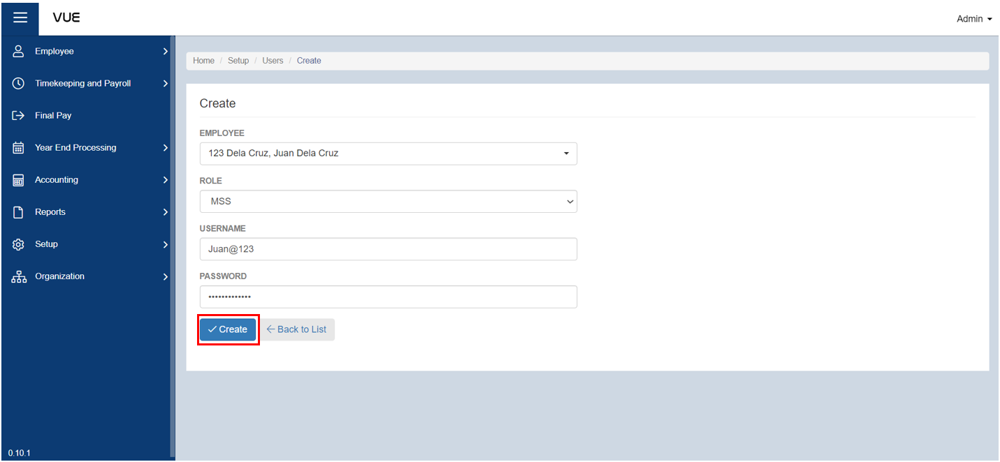
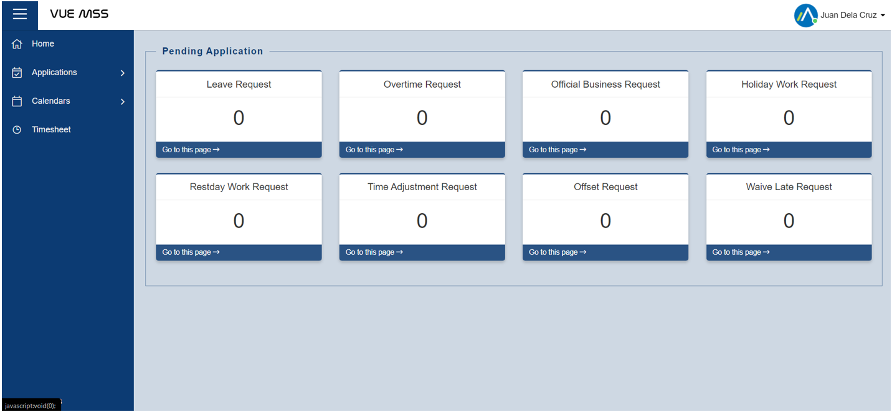

## Setting up MSS (Manager Self Service)

### Overview

This page provides a detailed guide on how to create or set up an account with a role of MSS (Manager Self Service). By following these step-by-step instructions, users will be able to create an account and configure the necessary settings to enable them to approve various employee applications, such as leaves, overtime, and more. 

### Step 1: Navigate to the Page
To navigate to the page:

&nbsp;&nbsp;&nbsp;&nbsp;&nbsp;&nbsp;&nbsp;&nbsp;&nbsp;&nbsp;&nbsp;**➥** Click on the **`Setup`** dropdown button.

&nbsp;&nbsp;&nbsp;&nbsp;&nbsp;&nbsp;&nbsp;&nbsp;&nbsp;&nbsp;&nbsp;**➥** Select **`Users`**.

### Step 3: Adding a New User (MSS)

:::info INFORMATION

This role is capable of **approving** the following requests:

- Leave Requests
- Overtime Requests
- Official Business Requests
- Holiday Work Requests
- Restday Work Requests
- Time adjustment Requests
- Offset Requests
- Waive Late Request

:::

To add a new user (MSS):

&nbsp;&nbsp;&nbsp;&nbsp;&nbsp;&nbsp;&nbsp;&nbsp;&nbsp;&nbsp;&nbsp;**➥** Click on the **`Add New`** button.

&nbsp;&nbsp;&nbsp;&nbsp;&nbsp;&nbsp;&nbsp;&nbsp;&nbsp;&nbsp;&nbsp;**➥** Select the **name** of the employee who is entitled to the role or will be the user of this account.

&nbsp;&nbsp;&nbsp;&nbsp;&nbsp;&nbsp;&nbsp;&nbsp;&nbsp;&nbsp;&nbsp;**➥** Select the **role** of the employee. For this instruction, choose **MSS** to set up an MSS or **Manager Self Service Account**.

&nbsp;&nbsp;&nbsp;&nbsp;&nbsp;&nbsp;&nbsp;&nbsp;&nbsp;&nbsp;&nbsp;**➥** Input a **username.**

&nbsp;&nbsp;&nbsp;&nbsp;&nbsp;&nbsp;&nbsp;&nbsp;&nbsp;&nbsp;&nbsp;**➥** Input a **password**. Make sure that the password is strong enough and not easily known by someone. Always remember your login credentials.

### Step 4: Saving

&nbsp;&nbsp;&nbsp;&nbsp;&nbsp;&nbsp;&nbsp;&nbsp;&nbsp;&nbsp;&nbsp;**➥** Click the **`Create`** button to complete the process.

### Step 5: Your MSS Account

&nbsp;&nbsp;&nbsp;&nbsp;&nbsp;&nbsp;&nbsp;&nbsp;&nbsp;&nbsp;&nbsp;**➥** After creating the MSS account, you can now log in and explore its content.

