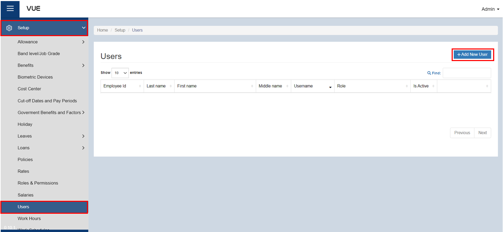
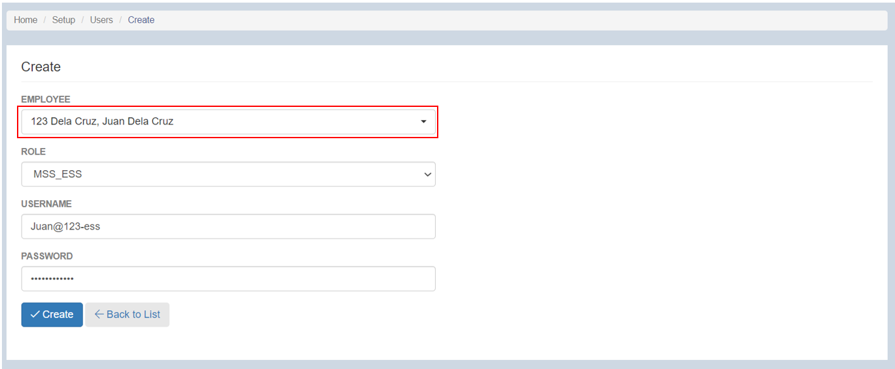

## Setting up MSS_ESS

### Overview

This page provides a detailed guide on how to create or set up an account with a role of ESS (Employee Self Service). By following these step-by-step instructions, users will be able to create an account and configure the necessary settings to enable them to perform time-in, time-out, and save attendance records. Additionally, they will be able to view the status of their submitted applications, such as leaves or requests, whether they are pending or approved. 

### Step 1: Navigate to the Page
To navigate to the page:

&nbsp;&nbsp;&nbsp;&nbsp;&nbsp;&nbsp;&nbsp;&nbsp;&nbsp;&nbsp;&nbsp;**➥** Click on the **`Setup`** dropdown button.

&nbsp;&nbsp;&nbsp;&nbsp;&nbsp;&nbsp;&nbsp;&nbsp;&nbsp;&nbsp;&nbsp;**➥** Select **`Users`**.

### Step 3: Adding a New User (MSS_ESS)

:::info INFORMATION

This role or account is used for managing employee attendance. The employee can perform the following actions:

Attendance:
- Time In
- Time Out

View pending requests for:
- Leave requests
- Overtime requests
- Official Business requests
- Holiday Work requests
- Restday Work requests
- Time adjustment requests
- Offset requests

:::

To add a new user (MSS_ESS):

&nbsp;&nbsp;&nbsp;&nbsp;&nbsp;&nbsp;&nbsp;&nbsp;&nbsp;&nbsp;&nbsp;**➥** Click on the **`Add New`** button.

&nbsp;&nbsp;&nbsp;&nbsp;&nbsp;&nbsp;&nbsp;&nbsp;&nbsp;&nbsp;&nbsp;**➥** Select the **name** of the employee who is entitled to the role or will be the user of this account.

&nbsp;&nbsp;&nbsp;&nbsp;&nbsp;&nbsp;&nbsp;&nbsp;&nbsp;&nbsp;&nbsp;**➥** Select the **role** of the employee. For this instruction, choose **MSS** to set up an MSS or **Manager Self Service Account**.

&nbsp;&nbsp;&nbsp;&nbsp;&nbsp;&nbsp;&nbsp;&nbsp;&nbsp;&nbsp;&nbsp;**➥** Input a **username.**

&nbsp;&nbsp;&nbsp;&nbsp;&nbsp;&nbsp;&nbsp;&nbsp;&nbsp;&nbsp;&nbsp;**➥** Input a **password**. Make sure that the password is strong enough and not easily known by someone. Always remember your login credentials.

### Step 4: Saving

&nbsp;&nbsp;&nbsp;&nbsp;&nbsp;&nbsp;&nbsp;&nbsp;&nbsp;&nbsp;&nbsp;**➥** Click the **`Create`** button to complete the process.

### Step 5: Your MSS_ESS Account

&nbsp;&nbsp;&nbsp;&nbsp;&nbsp;&nbsp;&nbsp;&nbsp;&nbsp;&nbsp;&nbsp;**➥** After creating the MSS account, you can now log in and explore its content.

